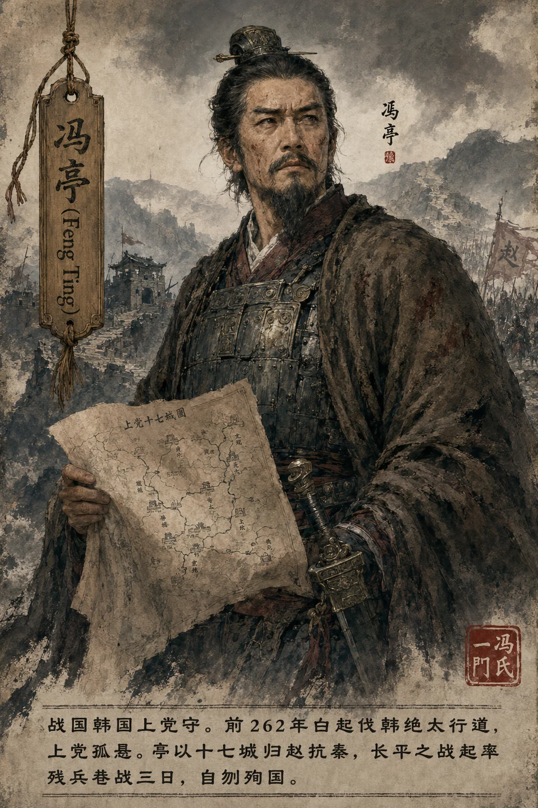
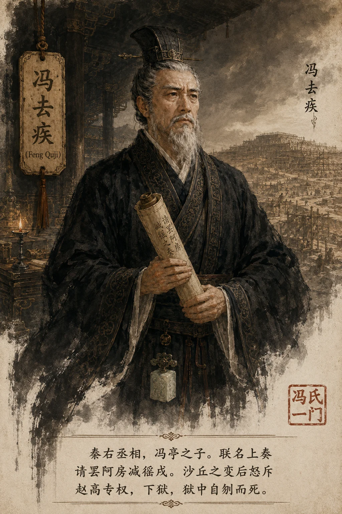
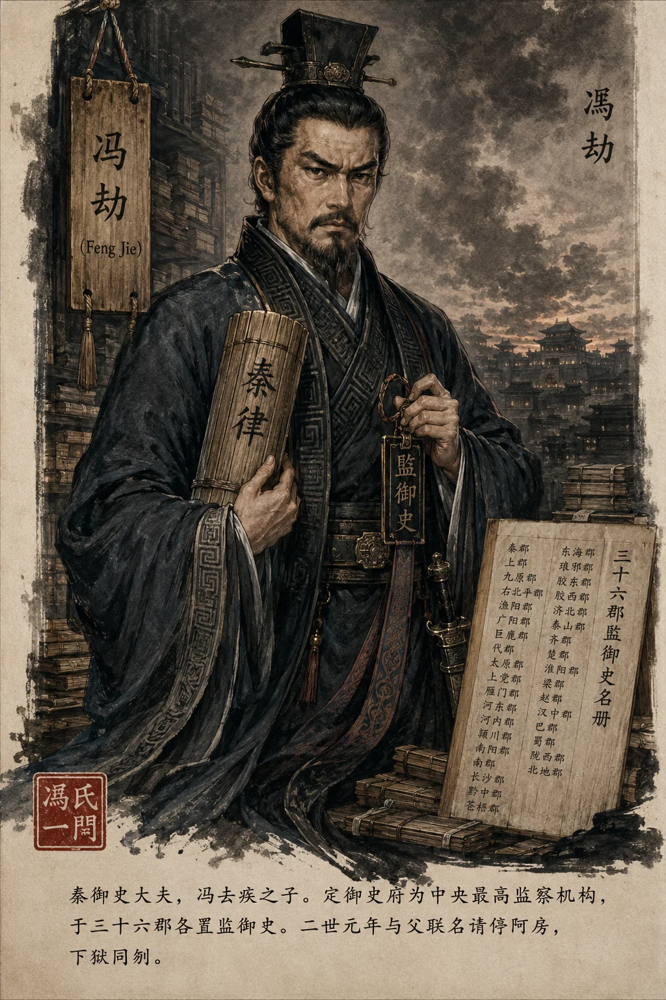

### **冯氏世家**

*冯亭像——上党守献地抗秦，忠义殉赵*

*冯去疾像——秦右丞相，死谏殉国*

*冯劫像——御史大夫，与父同死节*

**太史公曰**："冯氏之兴，始于韩上党守冯亭献地抗秦；其烈，见于秦右丞相去疾、御史大夫劫父子死谏殉国。三世四人，或殉赵、或相秦、或立法、或死节——同宗异途，而仁心一以贯之。太史公录冯氏，非独存一姓之史，实见战国士人于暴政之下，忠义可择、生死不苟之风也。"

---

#### **一、世系**

```
冯亭（韩上党守，献地殉国）
  ├─ 冯毋择（弟，奔赵，秦武信侯）
  └─ 冯去疾（秦右丞相，狱中自刎）
         └─ 冯劫（御史大夫，与父同死）
               └─ 汉：冯唐（劫孙）→ 冯奉世（亭六世孙）
```

> **太史公案**：冯亭献上党，本欲抗秦存赵，孰料反成秦灭赵之契机。**一念之仁，竟酿长平四十万之祸——历史之诡谲，莫过于此。**

---

#### **二、冯亭殉国——上党之献与长平之殇**

冯亭者，韩国上党守也。秦昭王四十五年（前262），白起伐韩，绝太行道，上党孤悬。亭召吏民议曰："韩不能守，秦虎狼不可降。宁付赵，合兵抗暴！"遂以十七城归赵。赵封亭华阳君，亭泣曰："吾以三不幸献地——入秦则臣于仇敌，一不幸也；以地嫁祸于赵，二不幸也；驱赵卒赴死战，三不幸也。"

长平之战发，亭率残兵巷战三日，身被六创，自刎殉国。**长平一役，赵损卒四十五万，自此一蹶不振。**

> **考古补证**：山西高平永录村发现长平尸骨坑（1995年），出土骸骨层层叠压，有刀伤箭簇，证坑杀之说不虚。

---

#### **三、冯去疾——右丞相谏罢阿房**

去疾初为秦将，以军功累迁右丞相。时阿房宫兴土木，骊山陵役民百万，四役并作，民力将竭。去疾与李斯、冯劫联名上奏："北筑长城，南戍五岭，戍漕转作，赋税苛重，此盗起之由！请罢阿房，减徭戍。"始皇默然未许。

沙丘之变后，赵高专权。去疾怒斥："阉宦乱政，秦室将倾！"遂与李斯、冯劫谋除赵高。李斯狐疑不决，事泄，二世下诏收三人。

---

#### **四、冯劫——御史大夫创监察制**

劫少习律令，通秦法。始皇并天下，召王绾、李斯与劫议帝号。劫定御史府为中央最高监察机构，于三十六郡各置监御史——**此为中国两千年监察制度之滥觞。**

二世元年，劫与父去疾联名上奏请停阿房。二世怒，下诏收三族。去疾、劫相视曰："将相不辱！"乃于狱中引剑同刎。血书狱壁："苛政不息，秦祀必绝！"

---

### **太史公曰**

冯氏父子，起于抗秦之烈族，而事秦于庙堂。观亭殉上党以存赵民，去疾罢阿房以恤苍生，劫定法典以立纲纪——三世事异，其仁一也！"刚极必折"，亭之烈固可敬矣，然致子孙流离；去疾、劫秉秦法而谏暴政，终陷两难。"诤臣死国"，赵高蔽日而二冯折槛，较之李斯苟活受五刑，尤见风骨。然秦失柱石，遂使章邯独木难支，悲夫！

**注**：本文据《史记·秦始皇本纪》《汉书·冯奉世传》、云梦秦简及近年考古成果综纂。