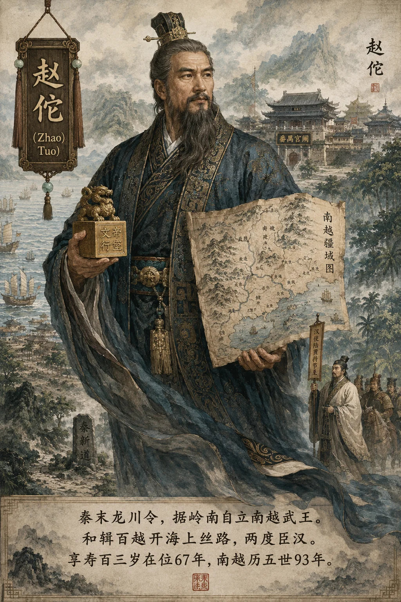
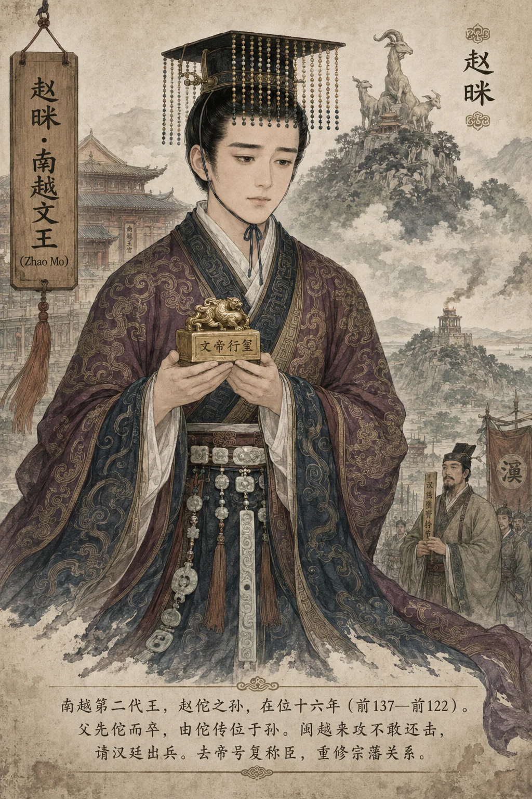
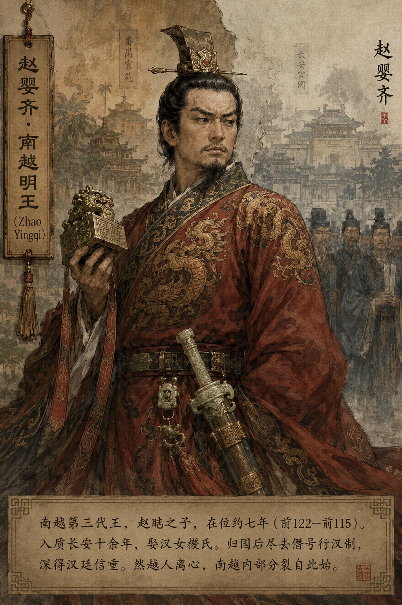
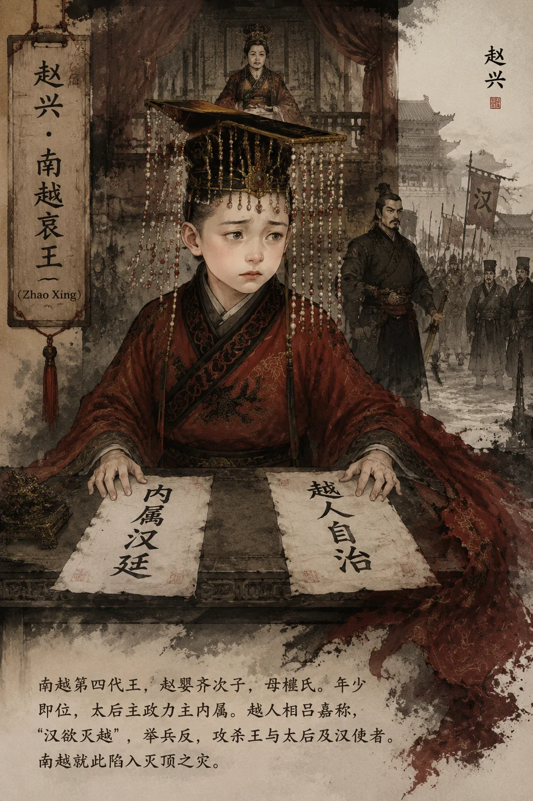

### **南越尉佗世家**

*赵佗像——南越武王，和辑百越，开岭表文明*

*赵眜像——南越文王，承父业守南疆*

*赵婴齐像——南越明王，两朝臣汉*

*赵兴像——南越哀王，年少不更事*

*赵建德像——南越末主，灭国于汉*

**尉佗者，真定赵氏子也（约前240—前137）。秦末为南海龙川令，裂百越而王南疆，两度臣汉而僭帝号，开岭表文明之新章。**

**太史公曰**："尉佗者，真定人也，姓赵氏。秦并天下，略定扬越，置桂林、南海、象郡。佗以龙川令适逢秦乱，诛秦吏、绝新道、击并桂林象郡，自立为南越武王。当是时，中原逐鹿，而佗坐拥岭南万里，和辑百越，称制与中国侔。及汉兴，文帝以德怀之，佗乃去帝号而复称臣。**以一秦吏起家，历五世九十三年，南越之祚竟与西汉相终始——此岂独佗之才耶？亦天时地利使然也！** "

---

#### **一、赵佗世系**

```
赵佗（南越武王/武帝，约前240—前137）
  ├── 赵仲始（佗子，先佗而卒，史失其详）
  │      └── 赵胡（眜，南越文王，前137—前122）
  │             └── 赵婴齐（南越明王，前122—前115）
  │                    ├── 赵兴（南越哀王，前115—前112，被弑）
  │                    └── 赵建德（南越末王，前112—前111，被俘）
  └── 赵光（佗族弟，封苍梧秦王，降汉封隨侯）
                                ——旁支续爵

南越五主：
1. 赵佗（约前240—前137，在位67年）—— 南越武王→武帝，享寿约103岁
2. 赵眜（一名赵胡）（前137—前122，在位15年）—— 南越文王
3. 赵婴齐（前122—前115，在位7年）—— 南越明王
4. 赵兴（前115—前112，在位3年）—— 南越哀王
5. 赵建德（前112—前111，在位1年）—— 南越末王
                               └── **历五世九十三年而亡**
```

> **太史公案**：南越一姓五主，侔于诸侯。**当秦之乱世，中原流血漂橹，而南越一方独安。非赵佗之仁，何以至此？** 后武帝以十万师平南越，其地终归汉家郡县——秦置的南海、桂林、象郡，至此才真正成为汉之版图。

---

#### **二、赵佗事秦——从龙川令到南海尉**

| **时间** | **事件** | **意义** |
|---|---|---|
| 始皇三十三年（前214） | 秦平南越，置南海、桂林、象郡；赵佗以秦吏身份随军南征 | — |
| 约始皇三十四年（前213） | 赵佗任南海郡龙川县令（今广东龙川） | **秦最南端的县令** |
| 始皇三十七年（前210） | 南海尉任嚣病笃，召赵佗语曰："闻陈胜等作乱，豪杰叛秦相立。南海僻远，吾恐盗兵侵地至此，欲兴兵绝新道，自备……" | 任嚣将南海郡托付赵佗 |
| 二世二年（前208） | 任嚣卒，赵佗行南海尉事 | **赵佗成为南海实际统治者** |
| 二世三年（前207） | 赵佗"移檄告横浦、阳山、湟谿关曰：'盗兵且至，急绝道聚兵自守！'"——绝秦所开新道，据关自守 | 南越割据始于此 |
| 秦亡（前206） | 赵佗诛秦所置长吏，以亲信代之 | 彻底脱离秦的控制 |

##### **任嚣托国三策**

任嚣临终召赵佗，剖陈大势曰："番禺负山险，阻南海，东西数千里，颇有中国人相辅，此亦一州之主也！"（《史记·南越列传》）遂授三策：

1. **绝新道**：毁横浦、阳山、湟溪三关通道，断中原兵锋；
2. **诛秦吏**："稍以法诛秦所置长吏"，换亲信为假守；
3. **待时变**：观诸侯成败，再定南向大计。

> *考古佐证*：广东南雄梅关古道发现秦代兵器埋藏层，或为赵佗毁道遗迹。

> **太史公案**：任嚣择赵佗为继，非因佗之能，因佗之"谨厚"——**一县令承一郡尉，岭南决于一语之间！** 秦廷在南海仅设郡尉，无監御史，故任嚣得以私授。二百年前商鞅设县制以防裂土，然南越僻远，鞭长莫及，郡尉裂郡如裂帛——**制度之限，终于地理之遥也！**

---

#### **三、南越立国与秦亡**

| **秦事** | **南越事** | **时间对应** |
|---|---|---|
| 陈胜吴广起义 | 赵佗绝新道、聚兵守关 | 前209—前207 |
| 刘邦入咸阳，秦亡 | 赵佗击并桂林、象郡 | 前206 |
| 项羽分封诸侯 | 赵佗出兵攻占越地，自立为**南越武王** | 前204 |
| 刘邦建汉，定都长安 | 赵佗称制、建宫室、行汉法 | 前202 |
| 汉惠帝、吕后专政 | 南越与汉断交，赵佗自尊号"南越武帝" | 前195—前180 |
| 汉文帝遣陆贾使南越 | 赵佗去帝号复称臣 | 前179 |
| 汉武帝元鼎六年 | 南越亡，置九郡 | 前111 |

##### **南越疆域四至**

佗吞桂林、象郡后，其疆域跨越今粤桂滇越四省区：

| **方位** | 所至 | 控制手段 |
|---------|------|---------|
| **北** | 五岭（今粤赣湘界） | 筑三道防线御汉 |
| **西** | 夜郎（今云贵） | 财物赂西瓯、骆越 |
| **南** | 象林（今越南顺化） | 水军控海路 |
| **东** | 闽越（今福建） | 联姻结盟 |

> 广州南越王宫遗址出土"蕃禺"铜鼎，铭"百廿斤"，证其称王建制之实。

##### **赵佗与刘邦的对比**

| **对比维度** | **刘邦（西汉高祖）** | **赵佗（南越武王）** |
|---|---|---|
| 出身 | 泗水亭长（无赖） | 秦南海郡龙川令（文吏） |
| 起兵 | 斩白蛇起义（前209） | 诛秦吏自立（前206） |
| 建国 | 前202称帝 | 前204称王 |
| 统治疆域 | 中原+关中 | 岭南三郡 |
| 治国策略 | 郡国并行、黄老无为 | **和辑百越、汉越杂处** |
| 在位年限 | 8年（前202—前195） | **67年（前204—前137）** |
| 寿数 | 62岁 | 约103岁（中国历史上最长寿的帝王之一） |

> **太史公案**：赵佗与刘邦同时代而寿数倍之。**当刘邦在长乐宫与韩信、彭越较量时，赵佗在岭南种田、和越、修城池。** 一个用战争定天下，一个用和平守一方——**创业之君与守成之主，各行其道**。然赵佗在位67年，儿子皆先他而逝，终传位于孙——晚境之孤，与始皇何异？

---

#### **四、南越制度——秦制在岭南的延续**

| **南越制度** | **秦源** | **南越变化** |
|---|---|---|
| 郡县制 | 秦设南海郡、桂林郡、象郡 | 南越仍保留郡县，但以越人首领为"邑君" |
| 官制 | 郡尉、县令 | 设"中尉""丞相"等（仿汉制，但规模缩小） |
| 文字 | 秦小篆、秦隶 | 南越国出土文物见秦篆、汉隶混用 |
| 货币 | 秦半两 | 南越自铸"半两"钱，亦用汉钱 |
| 法律 | 秦律为基础 | 南越"约法省禁"（比秦律宽简得多） |
| 度量衡 | 秦制 | 沿用秦制，汉文帝后部分改用汉制 |
| **和辑百越** | 秦"徙民杂处"政策 | **赵佗主动"椎髻箕倨"以从越俗——变强制同化为主动融入** |

> **考古补证**：
> - **广州南越王墓**（第二代王赵眜）：出土"文帝行玺"金印、"赵眜"玉印、"泰子"金印、丝缕玉衣、波斯银盒——**南越既尊汉礼、又融百越、复通西域**
> - **南越国宫署遗址**（广州北京路）：出土秦"蕃禺"漆器、汉"万岁"瓦当——证秦至汉的南越官署直接用秦城
> - **桂林甄皮岩遗址**周边的秦文化层——证秦至越的层次叠加

---

#### **五、和辑百越——赵佗最大的功业**

**赵佗和辑百越政策总表：**

| **政策** | **具体措施** | **效果** |
|---|---|---|
| **衣服饮食从越** | "椎髻箕倨"（束越人发髻、盘腿而坐） | 越人"以为仪则"——大王都像越人了，越人自然亲近 |
| **汉越通婚** | 赵氏宗室娶越女；越人首领娶汉女 | 弥合民族隔阂 |
| **以越人治越** | 任用越人首领为"邑君""郎将" | 保留越人自治权，减轻反抗 |
| **保留越俗** | 越人"断发文身"之俗不强制改变 | 文化包容 |
| **推广中原技术** | 铁器、牛耕、中医传入岭南 | 岭南农业从刀耕火种进入铁器时代 |
| **兴修水利** | 疏浚河道、修建城池 | 广州建城史由此始 |

##### **海洋文明开拓**

佗以南越濒海之利，开海上通途：

- **开辟海路**：船队达印度洋，《汉书》载"南越献珊瑚"；
- **异域来风**：南越王墓出波斯银盒、非洲象牙，证南越已入海上丝绸之路；
- **巫俗并存**：越巫祀蛇神，汉官祭舜陵——多元信仰共处一域。

广西贵港罗泊湾汉墓出土《东阳田器志》，载中原农具输越事。

> 新证​​：南越王墓出土波斯银盒经X射线荧光检测，其锡铅比例与大夏地区银器高度吻合，为南越经海上丝路连通西域之铁证。

> **太史公案**：秦以武力征服百越，"发卒五十万，使尉屠睢将"——然而三年不解甲，越人夜袭秦军，屠睢战死。秦以强制同化败，而赵佗以文化融入成！**强制与包容——同一块土地，同一批越人，政策一变，叛服立判。** 此赵佗之所以高于秦廷远矣！

---

#### **六、南越与汉的宗藩关系**

| **时间** | **事件** | **关系** |
|---|---|---|
| 汉高祖十一年（前196） | 陆贾初使南越，列侯说佗受王印 | 和好——南越称臣 |

> 陆贾至番禺，赵佗"椎髻箕踞"以倨态相见。贾厉声斥曰："足下中国人，反弃冠带！汉掘先人冢，夷宗族，一偏将十万众临越，如反覆手耳！"佗蹶然起坐，终受南越王印。然问贾："我孰与皇帝贤？"显藏不臣之心。
| 吕后五年（前183） | 吕后禁铁器、马牛羊输南越；赵佗怒称"南越武帝" | 决裂——南越独立 |
| 汉文帝元年（前179） | 文帝为赵佗真定祖坟置守邑、岁时奉祀 | 修复 |
| 汉文帝元年 | 陆贾再使南越，赵佗去帝号称臣 | 复归——南越再称臣 |

> 文帝三策抚佗：一修先冢（守真定赵氏祖坟，岁祀不绝），二宠昆弟（封佗族弟赵光为苍梧秦王），三重遣陆贾持诏赦罪。佗去帝号，上书自辩："老臣妄窃帝号，聊以自娱"，然国内仍潜用帝制——**此"外臣内帝"之策，开后世藩属双轨先河。**
| 汉武帝建元四年（前137） | 赵佗卒，年百余岁 | 南越与汉和平约60年 |

> **太史公案**：南越与汉的关系，系于赵佗一身。**佗在则南越安，佗老则南越乱。** 赵眜（第二代）懦弱，被闽越攻而不敢还击；婴齐（第三代）入质长安，归国后尽去武帝僭号；赵兴（第四代）年少，太后樛氏掌权欲内属——南越内争起，汉遂灭之。**非南越不强，乃后继无人。岂独南越，秦亦如此！**

---

#### **七、南越灭亡**

| **时间** | **事件** | **关键人物** |
|---|---|---|
| 元鼎五年（前112） | 南越相吕嘉反，杀赵兴、太后樛氏、汉使者 | 吕嘉（越人首领） |
| 元鼎五年秋 | 汉武帝遣路博德、杨仆五路大军攻南越 | 路博德、杨仆 |
| 元鼎六年（前111） | 汉军会师番禺，破城 | — |
| 元鼎六年 | 吕嘉、赵建德（末王）被擒 | 南越亡 |
| 元鼎六年 | 汉以南越地置九郡（南海、苍梧、郁林、合浦、交趾、九真、日南、儋耳、珠崖） | 秦三郡自此归汉 |

> **太史公案**：秦以武力置郡，越人反秦百年；汉亦以武力灭南越，而越人终归汉化。**秦则南越独立60年，汉则南越永为汉地——差在何处？在包容！** 汉置九郡后，延续赵佗"和辑百越"之策，不强制同化。三国时召燮治交州，越人安之——此皆赵佗遗泽也。

#### 八、后人命运——赵氏宗室的亡国之后

##### 建德末路，宗室星散

南越国亡后，末王赵建德与丞相吕嘉逃入海，被汉伏波将军路博德所擒，槛送长安。建德以叛臣之身被处死，南越赵氏王系绝嗣。赵婴齐前妻所生子赵次公（一名赵光）等宗室子弟或被杀、或被徙，南越宫廷百余年间积聚的珍宝器玩悉数北输汉廷。

##### 苍梧秦王归汉封侯

赵佗族弟赵光，受封苍梧秦王，据有苍梧一隅（今广西梧州一带）。汉灭南越时，赵光未与汉军死战，主动归降。汉武帝以其识时务，封为**隨侯**，食邑千户，赵光一脉遂入汉朝贵族序列（《史记·南越列传》载："苍梧王赵光者，越王同姓……闻汉兵至，降，封为隨侯。"）。此乃南越赵氏宗室中唯一得以延续爵位的分支。

> **太史公案**：赵光之降，非怯懦也，实存宗祀之智。**南越五主至此，一死一俘一降——而存者反是旁支，岂非天意？** 隨侯一脉延续至汉末，岭南赵氏谱牒多以赵光为承前启后之人。

##### 真定故里族人

赵佗本为真定（今河北正定）人。汉文帝怀柔南越时，曾"为佗亲冢在真定置守邑，岁时奉祀"，真定赵氏族人因此免于秦末战乱与汉初株连。南越亡后，真定赵氏未受清算，逐渐融入河北赵姓大宗。后世正定一带仍有赵佗先祖墓及祭祀遗迹，当地赵氏家谱多有追溯至赵佗者——**此支一脉，反存于北国，与岭南王业遥相呼应。**

##### 岭南遗民中的赵氏记忆

南越宗室在岭南并非尽灭。部分赵氏子弟在围城前逃入越人村落，改姓隐匿，与越人混居同化。今两广地区不少赵姓族谱自述为南越王赵佗之后，虽多系后世攀附，亦折射出赵佗在岭南民间的深远影响。广州番禺、南海一带有"赵王祠"等祭祀遗址，至唐宋时仍有香火。

> 新证​​：2005年广州南越国宫署遗址出土一批汉代封泥，其中数枚印文为"赵"字，年代跨南越至东汉初期，证南越亡后赵氏族人仍在原宫署区域活动，未遭完全清洗。

##### 越南的"赵朝"记忆

越南史书《大越史记全书》（吴士连编纂）以赵佗为"赵武王"，视南越为独立政权，并将其列为越南古代王朝之一——"赵朝"（Triệu triều），置于"雄王"与"征王"之间。按此史观：

- 赵佗开百越文教，以汉字取代雒越蝌蚪文；
- 赵佗在越南被尊为"武帝"，河内等地曾有"赵王祠"；
- 后黎朝史家视赵佗为"南国文教之祖"。

然此说亦多争议——越南近世史家如陈仲金《越南史略》，主张赵佗乃"中国官吏"，非越人君主，故"赵朝"之说不足为凭。

> **太史公案**：赵佗一人，身跨两国史——在中国为边疆藩王，在越南为开国君主。**一地两史，同人异评，非佗之事有异，乃观者之立场不同也。** 千载之下，赵佗仍以一人之身，系两国之争议，岂非历史之奇观？

#### **九、考异与补遗**

##### **后世三谜**

1. **称帝动机**
   - *野心说*：晋人嵇康斥"乘秦乱窃号自娱"；
   - *自保说*：清王夫之辩"禁铁器如断人手足，焉得不抗？"。
2. **长寿之谜**
   - 佗享寿103岁，南越王墓出"柘浆"（甘蔗汁）陶瓮，或为养生秘方。
3. **葬地疑云**
   - 广州越秀山有"赵佗墓"传说，然象岗山南越文王墓出"文帝行玺"，反证佗陵尚藏幽处。

##### **岭南记忆双面碑**

> **暴政指摘**：壮歌《布洛陀》怨"秦人戍岭，稻种北来"；
> **仁政颂扬**：广府年祭"佗王开埠"，珠江夜放莲花灯——
> **征服者与文明之父，竟在历史长河中合为一体。**

明末屈大均登越王台诗云："**山川霸气消沉易，陆贾风流教化长！**"今观岭南汉越基因融合度达23%（据复旦现代人种研究），更证尉佗"和辑百越"非虚——**当金戈铁马声远逝，文化融合之力终成跨越时空的永恒丰碑！**

---

### **太史公曰**

**"赵佗以一秦吏起，乘秦乱抚定百越，治岭南六十余载。当秦之苛政暴虐、汉之楚汉血战，南越独得安靖——此非天意，乃佗之和辑之功也！"**

**"尉佗之业，非武非文，乃乱世边臣存土安民之绝唱！"**

1. **秦之失**：秦以五十万兵征百越，屠睢战死、灵渠役夫鬼哭——**武力征服终被反抗吞噬**；
2. **佗之得**：赵佗以"和辑"两字，收越人之心。椎髻箕倨、汉越通婚——**文化包容胜于千军万马**；
3. **存亡继绝智**：秦亡时保岭南免战火，汉初导百越入华夏——**岭南之安，独得于天下大乱之中**；
4. **历史悖论**：他奠基的南越国祚93载，反比秦朝长十余年——**以仁守土者久，以暴取天下者速。**

> **青史镜鉴**：
> 今广州越秀山有五羊观，传为南越国祭天之所；山下南越王博物馆，藏"文帝行玺"金印，为岭南最古帝印。
> 两千年前，一个秦朝县令在这里开创了一个九十年的王国——
> 而他的祖国（秦），只存在了十五年。
> ​**​秦以铁血取天下，十五年而亡；赵佗以仁术守岭南，九十年而存。治国之道，岂不在兹乎？**