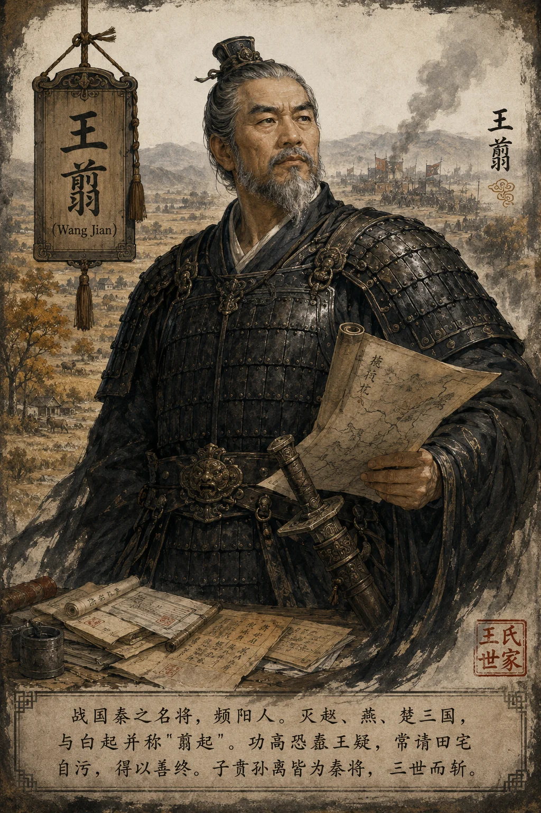
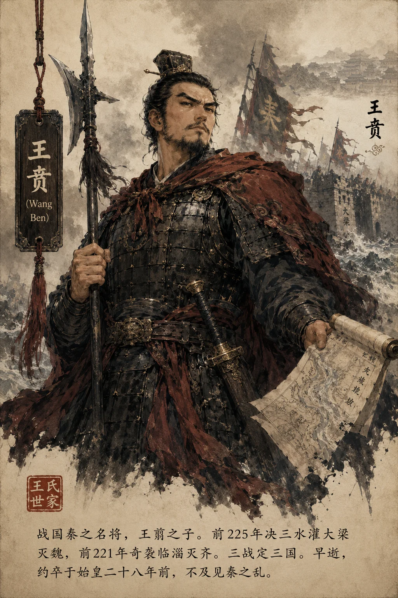
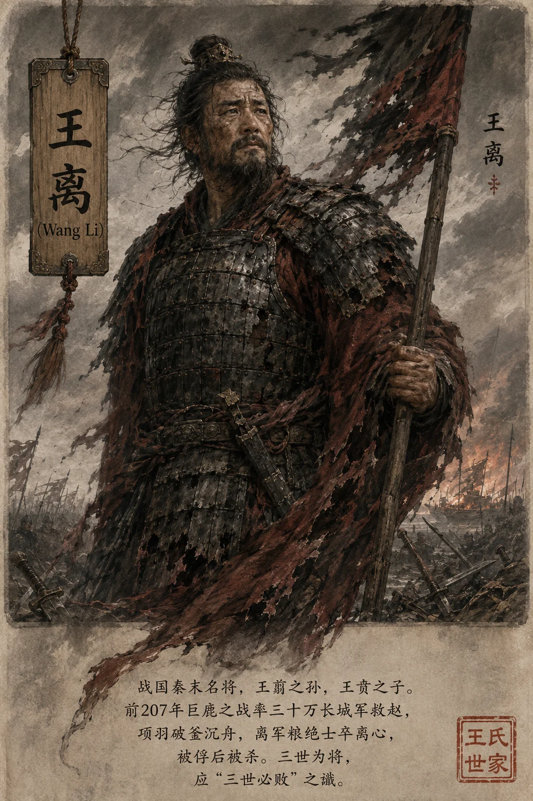

### **王氏世家**

*王翦像——频阳老将，三代征战，五国灰飞烟灭*

*王贲像——水攻灭魏，席卷燕齐*

*王离像——巨鹿之困，三世而终*

**太史公曰**："王翦以频阳老将，与子贲、孙离三代征战，破赵灭燕亡楚平魏收齐，五国灰飞烟灭。然翦功成身退得善终，贲承父业失势，离巨鹿败亡——三世兴衰，实乃秦军功爵制从巅峰到崩溃之缩影也。"

---

#### **一、世系**

```
王翦（灭赵灭燕灭楚，频阳人）
  └─ 王贲（水灌大梁灭魏，袭齐）
       └─ 王离（长城军救赵，巨鹿败于项羽）

王氏三代：
1. 王翦（前228-前224）—— 灭赵、燕、楚，功成身退
2. 王贲（前225-前221）—— 灭魏、灭齐，早逝
3. 王离（前209-前207）—— 长城军救赵，巨鹿被虏
```

> **太史公案**：王翦请田自保之智，在秦廷猜忌之政下尤为可贵。白起坑降卒而自刎杜邮，翦六十万灭楚而善终频阳——**知进知退者，翦之谓也。**

---

#### **二、王翦：灭三国的老将**

王翦少时习兵法，事秦昭襄王。至秦王政初立，翦以老将之姿，频献奇策。

**灭赵**：前228年，翦率军攻赵，反间郭开杀李牧，破邯郸，虏赵王迁。
**灭燕**：前226年，燕太子丹使荆轲刺秦，翦引军击燕，下蓟城，燕王喜奔辽东。
**灭楚**：前224年，翦请兵六十万伐楚，坚壁疲敌，大破项燕，虏楚王负刍。

**自污求田，避君之忌**：翦既功高，恐秦王疑，乃屡请田宅。王问："将军既贵，何求田宅为子孙业？"翦曰："臣为将，功终不得封侯，故及君之向臣，求田宅以自坚耳。"后李信败于楚，秦复用翦，终以老病辞，得以善终。

---

#### **三、王贲：灭两国的继者**

贲承父业，前225年率军伐魏，决黄河灌大梁，三月破城，魏亡。前221年，自燕南攻齐，猝袭临淄，齐王建不战而降。贲以三战定三国——水攻灭魏、追击灭燕、奇袭灭齐。然贲早逝，约卒于始皇二十八年前。

> **考古补证**：居延汉简载"通武侯贲部戍卒"，证王贲确曾统北疆军。

---

#### **四、王离：巨鹿败亡**

离袭父爵，为秦将。秦二世时，陈胜吴广反，离率长城戍卒三十万救赵，与章邯合兵。然章邯败于巨鹿，离军粮绝，士卒离心。项羽破釜沉舟，大破秦军，离被俘，后被杀。

**巨鹿之败，秦军气夺**：此一役，秦军精锐尽丧。离之败，非战之罪，实秦制崩坏——戍卒久戍思归，将帅失和，赵高弄权，粮道不继。

> **太史公案**：王翦功成身退，王贲早逝不及见秦亡，王离被杀——**三世为将，应"三世必败"之谶。此非天命，实秦制使然：军功爵制以首级论赏，三代以还，宗族坐大而君疑之，上下离心，不败何待？**

---

### **太史公曰**

王氏三代，以兵戈定天下。然功成而身退者，唯翦能全；贲虽勇，未免骄矜；离则恃旧勋，终为乱世所噬。**其兴也骤，其亡也忽。** 秦以军功立国，然暴虐失民，终致二世而斩。王氏虽善战，安能逆天命哉？**"飞鸟尽，良弓藏；狡兔死，走狗烹。"** 翦之求田，智也；贲之无谋，哀也；离之败亡，悲也。悲夫！

**注**：采《史记·白起王翦列传》《三王世家》等篇叙事风格。