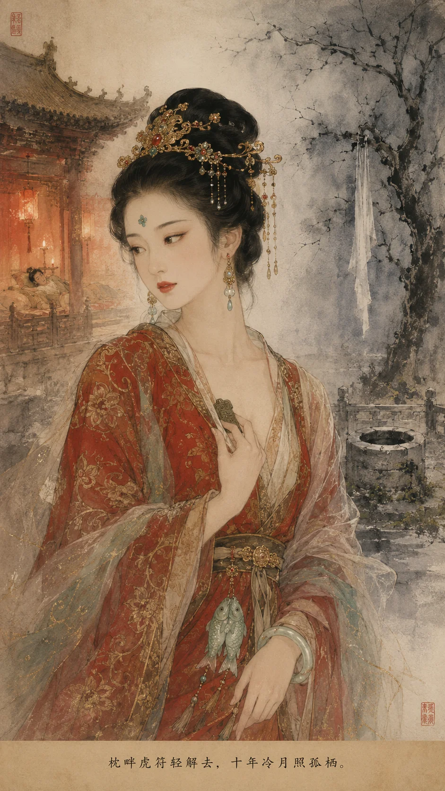

### **如姬列传**

*如姬——枕畔虎符轻解去，十年冷月照孤栖。*

**如姬者，魏安釐王宠姬也，其先世不可考，或曰晋阳豪族女，或曰魏臣之后。** 姬少时姿容绝艳，通音律，善歌舞，年及笄，选入魏宫。安釐王一见倾心，赞为"天上人"，即夜召幸，自此宠冠六宫。

姬善承王意，王每有忧色，姬辄以歌舞解之；王怒，姬则柔声劝慰。安釐王尝谓左右曰："寡人得如姬，胜得十城。"寝宫秘钥悉付其手，宫人皆畏而媚之。然姬虽得专房之宠，未尝恃宠而骄，每以恩惠下人，故宫中多称其贤。

**初，姬父为豪侠，遭仇家所害，姬悬赏三载不得报，日夜饮泣。** 信陵君魏无忌闻之，阴遣门客诛仇首，献首级于姬。姬泣拜曰："妾父仇雪，皆公子恩也！他日虽肝脑涂地，不敢辞！"自此，姬与信陵君结刎颈之交，虽深居宫闱，心系公子安危。

---

#### **窃符之夜**

**周赧王五十八年（前257年），秦围邯郸，赵平原君数遣使求救于魏。** 安釐王畏秦，令晋鄙将十万众屯邺，按兵不动。信陵君患之，谋于门客侯嬴。嬴曰："虎符藏于王寝，唯如姬可窃。姬感公子恩，必为效死！"

信陵君夜入宫，密会如姬。姬迎公子于内室，屏退左右。公子具道秦围邯郸之危、唇亡齿寒之理，言至痛处，泣下沾襟。

姬默然良久，徐曰："妾父仇雪，公子之赐也。妾日夜思报，恨无其时。今公子有命，妾何敢辞？然大王寝中虎符，置于枕下铁函之中，须待大王熟睡方可取。公子且去，三更时分遣人在宫门等候。"

是夜，如姬盛妆侍王，亲奉美酒。安釐王本不好酒，姬娇声劝饮，王不觉数觥，酩酊大醉。姬扶王就寝，少顷王鼾声如雷。姬自解罗带，赤身钻入锦被，紧贴王身，确认王已沉睡。乃轻舒玉臂，探入枕下，启铁函，取虎符。又以蜡印封函如故，乃以罗衣裹符，使侍女送公子于宫门之外。

> **太史公案**：如姬盗符，身在王榻而心在公子。**一女子于枕席之间，定魏赵两国之存亡。** 情欲忠义之际，一念之差，可成可败。姬以报恩之心行盗符之举——非不忠于王，乃忠义两难间不得不为也。

---

#### **窃符之后**

安釐王晨起，不见虎符，大惊，拷掠宫人。姬挺身出曰："妾盗符也。妾父仇，公子报之。妾今为公子窃符救赵，愿大王治妾之罪！"

安釐王震怒："寡人待汝不薄，宠冠六宫，汝竟背寡人而助外人！"姬伏阶泣曰："妾盗符为救赵存魏。若秦得志，大王社稷安在？今赵已安，妾愿就鼎镬以谢天下！"王默然良久，终不忍杀，但囚之于冷宫。

姬被囚于西苑井亭，日采荇为食，夜诵《诗·柏舟》，声闻宫外。安釐王尝使宦者探之，姬拒不见，曰："妾罪当诛，岂敢以残躯玷污大王！"王闻之，默然垂泪。

---

#### **十年冷宫**

如姬在冷宫十年，未尝一日忘魏。每闻秦军东进，辄向北而泣。前247年，信陵君率五国联军败秦于河外，姬闻报大喜，对月起舞于井亭之侧，如当年在邯郸时——然年已衰，发已白，舞罢泣下沾襟。

**其后十年，秦灭魏，安釐王亡走大梁。** 姬闻之，整衣束发，沐浴更衣，取白绫自缢于冷宫槐树下。遗书曰：

> "妾生为魏姬，死为魏鬼。秦贼未灭，妾魂当缚王于地下！"

国人哀之，葬于邺城郊，立碑曰"义姬冢"。至今邯郸父老犹传："如姬井，冷宫槐，夜半犹闻白绫哀。"

> **考古补证**：邯郸故城遗址西苑区域发现战国水井一口，井台有"姬"字刻铭，或即如姬冷宫所居之处。井旁出土残破漆奁，内藏铜镜一面，铭文隐约可辨"义姬"二字。

---

### **太史公曰**

如姬以宠姬之身，行烈士之事。其盗符也，非为一己之仇，乃存赵以安魏，虽妇人犹知唇亡齿寒之理。然君心难测，功成反噬，幽囚冷宫十年，终以身殉——情与义、忠与仇，如姬一身兼之。后世但知信陵君之侠，罕知姬之烈，惜哉！

**叹曰**：

> 枕畔虎符轻解去，十年冷月照孤栖。
> 邯郸围解功成日，正是西苑锁眉时。
> 白绫系断家国恨，青史空留义姬碑。
> 若问红颜何处烈，邺城郊外草离离。

**注**：本文据《史记·魏公子列传》《战国策·魏策》及邯郸出土战国文物综合而成。