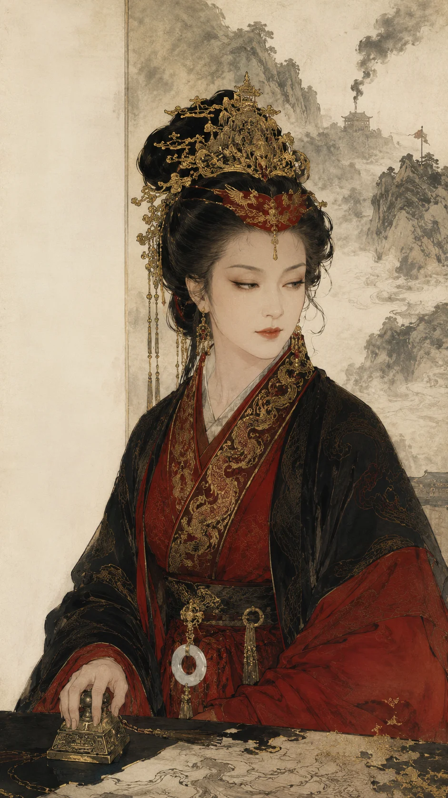

### **宣太后列传**

*宣太后芈八子——楚女入秦，以五等妾御一跃为太后，摄政四十一载，情杀义渠王，举白起拓疆千里。*

**宣太后者，楚人也，芈姓，号八子。** 为秦惠文王之姬，生秦昭襄王。惠文王卒，昭襄王年少即位，太后摄政，开中国历史"太后"称制之先河。**摄政四十一年（前306—前266），用魏冉、举白起、破楚郢、弱诸侯——秦之霸业，半出此妇人之手！**

---

#### **一、从芈八子到宣太后**

芈八子本楚之宗女，嫁秦惠文王为妾。惠文王后宫分八级：王后、夫人、美人、良人、八子、七子、长使、少使——"八子"乃第五等，位不甚尊。然八子以美色与智谋得幸于惠文王，生公子稷（即昭襄王）。

惠文王卒，武王立；武王举鼎死，无子。诸弟争立，芈八子之异父弟魏冉拥兵诛公子壮，立稷为秦昭襄王。昭襄王年少（约19岁），尊芈八子为"太后"——此为"太后"一词首次见于中国史册。

---

#### **二、治国功业**

太后摄政四十一年，用魏冉为相，举白起为将。伊阙斩韩魏二十四万，鄢郢拔楚都，秦疆域扩张十倍。**白起之兴，太后之功也。**

---

#### **三、义渠三十年的情与杀**

义渠戎国为秦西方大患，屡犯边境。太后审时度势，不用兵而用色——以身许之。

**诱戎王**：义渠王来朝咸阳，太后设宴款待，亲为把盏。戎王本为西北豪雄，见太后风姿绰约、言辞爽朗，不觉心醉。宴罢，太后留戎王子宫中，夜夜召见，"侍寝"以为常。戎王自此安居咸阳，不复思归。

**三十年私通**：太后与戎王同居，出入宫闱无禁。戎王每欲归国，太后辄以温言慰留，使义渠三十余年不犯秦境。其间太后与戎王生二子，皆养于宫中。朝臣或谏，太后笑曰："一妇人之身，能换西方三十年太平，岂非大有利于秦乎？"

**甘泉宫杀**：前272年，秦已强，义渠不足为患。太后召戎王会于甘泉宫，盛陈酒乐。戎王醉卧，太后伏甲士于帐后，尽杀之。秦遂发兵灭义渠，置陇西、北地、上郡。太后所生二子，亦不知所终。

> **太史公曰**：以一女子之身，诱戎王三十年，同床共枕、生子育女，终杀之而灭其国——**此千古未有之奇策！** 张仪以舌取地，太后以身取国——一舌一身，皆秦之利器。然太后杀夫灭国，面不改色——**情欲于太后，不过工具耳。爱与杀，同一人、同一手。**

---

#### **四、太后与魏冉：同胞亦情人？**

魏冉者，太后之异父弟也。太后执政后，以魏冉为将军，封穰侯，食邑穰地。魏冉出入宫闱无禁，常与太后深夜密谈。朝野传言二人关系非同寻常——虽无确证，然魏冉始终为太后最亲信之人，权势之盛，冠绝群臣。范雎说秦王曰："臣闻秦之有太后、穰侯，不闻其有王。"以太后与穰侯并列，可见二人关系之密。

---

#### **五、"妾事先王"——以房事喻国事**

韩国被秦所逼，遣使求救于秦。宣太后召见韩使尚靳于后宫，尚靳涕泣请援。太后从容问曰："妾事先王也，先王以髀加妾之身，妾弗胜也；尽置妾之上，而妾弗重也——何也？以其少有利焉。"

满座愕然，尚靳不能对。

太后笑而释之："今佐韩，兵不众、粮不多，则不足以救韩。夫救韩之危，日费千金，独不可使妾少有利焉？"

**太史公案**：太后以房中体位喻国际关系——在上者不重、在下者不支，两利方得长久。**先秦女性之直率、之自信、之辛辣，无过于此！** 后世儒生讳言，不敢录于正史。然太后真性情于此毕现——以房事明政事，千古独此一女！

> **新证​​**：马王堆汉墓出土帛书《战国纵横家书》录此语，与《战国策·韩策》所载吻合，证太后所言非后世杜撰。

---

#### **六、太后失权与晚年**

昭襄王渐长，魏人范雎入秦说王曰："臣居山东时，闻齐之有田文，不闻其有王；闻秦之有太后、穰侯，不闻其有王。今太后擅行不顾，穰侯出使不报……王上孰与秦之王？"昭襄王惧，遂废太后，逐魏冉。太后失权后不久去世，葬于芷阳骊山。

---

#### **七、宣太后之传奇性**

| **创举** | **细节** |
|---|---|
| 第一个称"太后" | "太后"一词始于宣太后，沿用两千年 |
| 第一个太后摄政 | 开吕后、武则天、慈禧之先河 |
| 情杀灭国 | 以情妇身份诱义渠王三十年，生子复杀之灭其国 |
| 房事喻国 | "妾事先王，以髀加妾身，妾弗胜"——外交史上的惊世骇俗之语 |

> **考古补证**：
> 1. **秦封泥"宣太后玺"**——西安相家巷出土，为太后权力之实物
> 2. **义渠故地（今甘肃宁县）**战国晚期秦式墓葬剧增，证义渠灭后秦移民实边
> 3. **芷阳秦东陵**——疑宣太后葬于此，形制极高

---

### **太史公曰**

**宣太后以一身四用**：以色固宠于惠文王，得立其子；以权执政于秦廷，四十年不衰；以情诱义渠王，杀之灭国；以房事喻国政，开千古未有之奇谈。**然太后之败，在不知收权。母子权力不可并存，此太后政治之原初悖论。**

中国历史上有此一女，可抵百万男儿！

**叹曰**：

> 楚女入秦为八子，一朝摄政定秦基。
> 白起魏冉皆门下，义渠戎王卧榻栖。
> 甘泉宫变杀夫日，韩使座前说体位。
> 千古兴亡多少事，太后一笑胜须眉。

**注**：本文据《史记·秦本纪》《史记·穰侯列传》《战国策·韩策》及马王堆帛书综合而成。