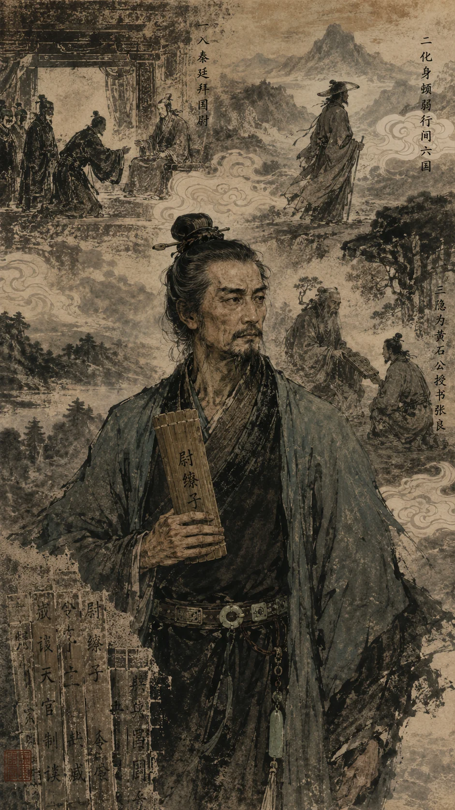
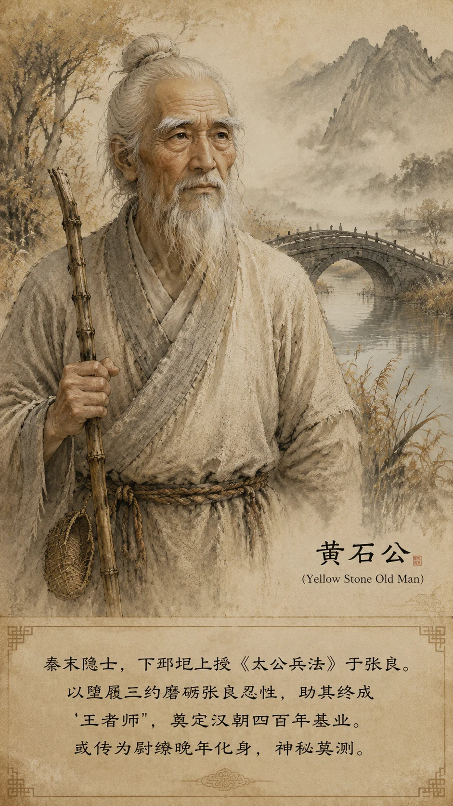

## 尉缭传​​

*尉缭子像——兵家入秦，铸剑为犁*

> **太史公曰​​：**战国之士，或显于庙堂，或隐于草野，然如尉缭子之身兼将相谋略而名实难辨，顿弱之纵横六国而史迹湮微，黄石公授书圯上而托身黄石，皆千古奇人也。余观其行迹若星散云合，乃合而述之，以俟后世明者。按清沈钦韩、今人杨宽考，顿弱即尉缭化名，一人分传；黄石公亦或为尉缭晚年托身，故合为一传。

**尉缭者，战国最神秘的人物之一。他身兼兵家、纵横家、道家三家之长，以《尉缭子》二十四篇奠定秦军制之基，又以"万金间六国"之策拆解合纵，更以"化名三身"之奇成为中国历史上最扑朔迷离的智者。**

------

#### **一、尉缭本传：兵道入秦，铸剑为犁**

**尉缭者，魏之大梁人也**，或曰名缭，世称尉缭，盖因官秦国尉得名。其先乃魏国尉官世族，然身负鬼谷纵横之术，通阴阳，晓兵势。尝游稷下，师荀子，友韩非、李斯。**晚收王敖为徒，尽授纵横之术，敖后称末代鬼谷子。**

**秦王政十年（前237年），缭入秦献策。** 时秦强而六国未附，缭献三策：

| **策略** | **内容** | **效果** |
|---|---|---|
| **金间** | "愿大王毋爱财物，赂其豪臣，乱其谋"——亡三十万金，则诸侯可尽 | 从姚贾、顿弱行间六国，瓦解合纵 |
| **重农** | "夫土广而任则国富，民众而治则兵强"——农战为本，粮秣为先 | 郑国渠成后，秦粮草供应十倍于前 |
| **明法** | "杀一人而三军震者，杀之；赏一人而万人喜者，赏之"——刑赏分明 | 兵无二心，将无二令 |

##### **国尉与秦军制**

尉缭拜国尉掌秦军，对秦军编制、训练、军法进行了系统性改革——**《尉缭子》之理论，由此化为秦卒之刀剑**：

| **改革** | **《尉缭子》理论** | **秦军实践** | **考古印证** |
|---------|------------------|-------------|-------------|
| **军队编制** | "卒伍定则兵强"——以伍、两、卒、旅分阶 | 兵马俑军阵可见四重编制：步兵/弩兵/车兵/骑兵各自成阵 | 秦俑坑军阵九宫格布局，每格一"乘"编制 |
| **训练教战** | "教战分阶，先训后用"——单人→队→阵逐级训练 | 秦剑格上刻工名、检验官名——标准化训练体系 | 秦青铜剑刃部铬化处理，误差<0.1mm |
| **刑赏军法** | "杀一人而三军震，赏一人而万人喜" | 二十等爵制与"什伍连坐"结合——战功可致富贵，怯战则连坐 | 睡虎地秦简《军爵律》详载爵级分配与转让细则 |
| **兵不攻无过** | "兵不攻无过之城，不杀无罪之人" | 秦灭六国虽残暴，却屡行"赦罪人迁之"——降者免死徒边 | 云梦秦简《迁子》记载降卒迁徙具体案例 |

> 新证​​：兵马俑坑出土秦弩实测误差≤0.2mm，青铜剑表面含铬氧化层——**秦军工之精密标准化，正是尉缭"卒伍定则兵强"理论的物质化呈现。** 每一件兵器都可互换零件，每一个士兵都是军国机器中的一颗螺丝——**制度之人，始成无敌之师。**

秦王奇其谋，尊为上客，**"衣食与王同，见王不拜"**，秦廷独此一人。然缭私谓弟子曰："秦王蜂准豺声，**少恩而虎狼心**，得志必轻食天下！"遂遁去。秦王追还，立誓拜**国尉**（最高军事长官），主兵事。

> 新证​​：山东临沂银雀山汉墓（1972年）出土《尉缭子》残简，与传世本基本吻合，证此书非后世伪托，确为先秦兵书。简文"兵不攻无过之城，不杀无罪之人"一句，与传世本一字不差。

##### **尉缭的师承与时代坐标**

尉缭生于战国末世，其思想渊源可溯三家：

| **师承/渊源** | **影响** | **证据** |
|-------------|---------|---------|
| **鬼谷纵横术** | 合纵连横、阴谋阳谋——"万金间六国"之策自此出 | 与张仪、苏秦同属纵横学派，重"捭阖"之术 |
| **荀子** | 人性恶而可化、礼法并用——"明法"一策源于此 | 与李斯、韩非同游稷下，《尉缭子》重"礼法"可证 |
| **商鞅变法实践** | 以农战立国、以军功赏爵 | 《尉缭子》多处引商鞅"什伍连坐""二十等爵"之法 |

尉缭入秦时（前237年），正值嫪毐之乱已平、吕不韦罢相——秦廷新旧交替、急需人才。同时入秦的还有李斯（已为客卿）、韩非（使秦而被囚）、姚贾（出使四国）。**同一时代、同一朝廷，荀子的三个学生各走一路：韩非以法家学说入、李斯以权谋术数进、尉缭以兵家纵横出——三人三途，皆欲拯乱世，而皆未得善终。**

##### **生平时间坐标**

| **时间** | **事件** |
|---------|---------|
| 约前280年 | 尉缭生于魏国大梁（推测） |
| 约前260-240年 | 游学稷下，师从荀子，与韩非李斯同门 |
| 前237年 | 入秦献策，拜国尉 |
| 前236-230年 | 以顿弱化身行间六国，谗杀李牧 |
| 约前230-220年 | 见秦王暴政日甚，遁去不知所往 |
| 约前220-210年 | 以黄石公化身隐于下邳 |
| 约前210年 | 圯上授书张良 |
| 前204年 | 张良用《太公兵法》佐刘邦灭秦——尉缭之策终见天日 |

#### **二、顿弱化身：万金破合纵**

尉缭最奇者，在于**化身顿弱游说六国**。《战国策·秦策四》载其见秦王政之始末，精彩绝伦——

顿弱入秦，秦王召见。**弱见王不拜**，左右责之。顿弱从容对曰：

> "天下有有其实而无其名者，有无其实而有其名者，有无其名又无其实者。大王知之乎？"

秦王曰："不知也。"顿弱曰：

> "有其实而无其名者，**商贾**是也。朝市夕廛，金玉满堂——实有万金之富，而名不显于诸侯。
>
> 无其实而有其名者，**农夫**是也。胼手胝足，终岁勤苦——名曰劳苦，而实无温饱。
>
> 无其名又无其实者，**大王**是也。已立为万乘之主，而**无孝之名**——奉养千里，而**无孝之实**；威严不行于山东六国，而加于母后。此臣所以不拜也。"

——此即千古知名的**"有名无实"之辩**，以商贾、农夫、君王三喻，直刺秦王两大痛处：不迎母后赵姬于雍（不孝），不能兼并六国（不威）。**一席话，将秦王的软肋尽数摊开。**

秦王政勃然变色，然亦知其言切中要害，乃谢曰："先生教寡人。"

遂问曰："山东六国，可并乎？"

顿弱曰：

> "**韩国，天下之咽喉；魏国，天下之胸腹。** 王请以万金资臣，东游韩、魏，入其将相。韩、魏从秦，则天下可图矣。"

秦王曰："寡人国贫，恐不能给万金。"

顿弱曰：

> "天下之势，非合纵则连横。
>
> **连横成则秦为帝，得天下供奉；合纵成则楚为王，六国皆属楚。**
>
> 若秦为帝，何忧万金之费？若楚为王，纵大王有万金，亦非大王之有也。"

——**以"得失利害"逼秦王出资，将国家战略与万金之费绑定。** 秦王大悟。

> **太史公曰​​：**顿弱之说秦王，前后三变。始以"三喻"激之，使秦王怒而不敢发——**飞箝也**；中刺"不孝不威"之辱，使秦王惭而虚心——**抵巇也**；终以万金之策许之以帝业，使秦王贪而从——**揣摩也**。**一席话而三术并用，鬼谷之绝学尽在其中矣。**

秦王于是**资以万金**，遣顿弱东行。弱遂入韩、魏，以金帛收买其将相，使之入秦为间，尽知两国虚实；北游燕、赵，重赂赵王宠臣**郭开**，使其谗杀名将**李牧**（参见 [郭开列传](/列传/郭开列传.md)）；最后东至齐，厚赂荒淫之相**后胜**（参见 [后胜列传](/列传/后胜列传.md)），使齐王建不修战备，坐视五国灭亡。**终使齐王入朝，四国毕从——不战而屈人之国，纵横之极致也。**

*黄石公像——圯上授书，托身黄石，尉缭晚年化身*

#### **三、黄石公化身：授书兴汉**

黄石公者，下邳隐士也，白眉皓首，时人莫知所出。或言其本名**魏辙**，乃秦庄襄王旧臣，因谏始皇暴政不纳，挂冠隐于邳州黄山，故取"黄石"为号。

**圯上授书，千古奇遇**：张良匿下邳，游沂水桥。公故堕履，叱曰："孺子取履！"良忍辱跪进。公笑受，约五更三至，始出一编授之："读此则为王者师矣！十三年济北谷城黄石即我。"旦视乃《太公兵法》。

**尉缭即黄石公的佐证**：

- **兵书同源**：《尉缭子》引《六韬》"无天于上，无地于下"之句，与张良所得《太公兵法》同源；
- **时间吻合**：尉缭遁秦后"不知所往"，黄石公现身正当秦末——前后相距约三十年，恰合缭晚年行迹；
- **精神暗合**：尉缭谏秦王"毋轻食天下"，黄石公教张良"忍辱济世"——同一思想的一体两面；
- **博浪沙伏笔**：张良误中副车，或因尉缭昔日"六驾混淆"之策犹在心中。

#### **四、《尉缭子》兵法要义**

《尉缭子》二十四篇，融合儒、道、法、兵四家，为战国兵书之集大成者。银雀山汉简出土证实其真实性后，学界重新评价其地位——**不下《孙子兵法》**。

| **卷次** | **篇目举要** | **核心思想** | **考古实证** |
|---|---|---|---|
| 卷一 | 天官、兵谈 | **人事胜鬼神**——"举贤任能，不时日而事利" | 银雀山简本与传世本一致 |
| 卷二 | 守议、武议 | **攻守一体**——"城守必救，攻在于意表" | 秦军野战+攻城战术的纲领 |
| 卷三 | 重刑令、伍制令 | **连坐绝逃**——刑赏贵大，怯者不敢退 | 与云梦秦简"什伍连坐"律条吻合 |
| 卷四 | 勒卒令、踵军令 | **行军如一体**——金鼓旌旗，号令严明 | 秦兵马俑军阵布局的生动写照 |
| 卷五 | 兵教、兵令 | **教战分阶**——"挟义而战"，先训后用 | 秦军"科头"（不戴头盔）敢死战术的文化根源 |

> 新证​​：兵马俑坑出土秦戈铭文"寺工"（秦中央兵器制造机构），证《尉缭子》"兵不攻无过之城"的理想虽高，秦军实际装备之精良亦天下无双——**理论与实践的完美结合，方有秦军横扫六合之势。**

##### **《尉缭子》三大核心思想**

**一、义兵——师出有名**

《尉缭子》认为"兵不攻无过之城，不杀无罪之人"，将战争正当性置于战略首位。其曰："凡兵不攻无过之城，不杀无罪之人。夫杀人之父兄，利人之货财，臣妾人之子女，此皆盗也。"——此非迂腐之论，而是极其清醒的认知：**师出无名则士气不振，暴行累累则民心不附。** 秦灭六国时虽有暴行，但每灭一国必"赦其罪人，迁其豪富"，正是尉缭此策的实践。

**二、气战——士气为先**

《尉缭子》将"气"视为决定胜负的关键——"气实则斗，气夺则走""机在于应事，战在于治气"。以吴王夫差之败为例："夫差以兵取胜，而卒见擒于越，气衰故也。"秦军之所以能以弱胜强、以一当十，根本在于二十等爵制激励下的士气——**"秦人闻战则喜，父送子、妇送夫"——此即"气战"的现实体现。**

**三、分卒——灵活机动**

《尉缭子》主张"分卒则明，合卒则众"，强调战场上分合有度。其曰："卒伍定则兵强，行阵正则战胜。"秦兵马俑军阵中步兵、弩兵、车兵、骑兵各成方阵，战时"更战更息"——**分则各当其面、合则协同歼敌，正是"分卒"理论的完美呈现**（参见 [兵书·秦军阵](../书/兵书.md)）。

##### **与《孙子兵法》的比较**

| **维度** | **《孙子兵法》** | **《尉缭子》** |
|---------|----------------|---------------|
| 核心关怀 | "兵者诡道"——以谋略取胜 | "兵不攻无过"——以义兵安民 |
| 制胜途径 | "不战而屈人之兵"——奇谋 | 气战、制度、编制——制度决胜 |
| 道德立场 | 价值中立——慎战而非义战 | **价值介入**——暴虐不可取天下 |
| 时代背景 | 春秋争霸 | 战国统一前夕 |
| 后世影响 | 军事策略的圣经 | 秦军制/汉律令的兵学基础 |

> **太史公曰**：孙武重谋，尉缭重制。**谋可胜一时，制度可胜百代。** 《孙子》教将领如何赢下战争，《尉缭子》教国家如何准备战争。秦之所以能横扫六国，非有孙武之奇谋，乃有尉缭之制度——**制度之兵，天下无敌。**

---

#### **五、考异与补遗**

##### **银雀山汉简定年与价值**
1972年山东临沂银雀山一号汉墓出土《尉缭子》竹简三十六枚，与《孙子兵法》《孙膑兵法》同出一墓。墓葬年代为汉武帝初年（约前140年），此时距尉缭在世不过百年。简本文字与传世本高度吻合，证明：
1. 《尉缭子》非后世伪托，确为先秦兵书；
2. 传世本虽经辗转抄录，核心文字未失原貌；
3. 尉缭思想在汉初仍有广泛影响。

##### **"一人三面"论学术史**
尉缭=顿弱=黄石公之说，非本书独创，乃数百年来诸家考证的集成：

| **学者** | **观点** | **依据** |
|---------|---------|---------|
| 东汉·**高诱** | **尉缭即黄石公，阴符授张良** | 《吕氏春秋》注：“嬴氏礼缭，合从散而宇内平。缭亡去嬴秦失人也……嬴秦失鹿，灭楚功成，**盖缭阴符授留侯故也**。”——最早将尉缭与圯上授书直接联系的文献 |
| 清·沈钦韩 | 顿弱即尉缭 | 《汉书疏证》：顿弱言行与尉缭策合 |
| 清·谭献 | 黄石公非神怪 | 黄石即"老丈"，是隐姓避秦者 |
| 清·**梁玉绳** | **尉缭踪终圯上，史迁匠心** | 《史记志疑·补识》：“夫缭者，《始皇本纪》一疑故也。踪迹无终，阅之悒悒焉。**然观圯上授书，心忖然说，始明史迁匠心，以是叙缭之竟也**。”——以《史记》叙事结构证尉缭与黄石公的同一性 |
| 今人·杨宽 | 尉缭=顿弱 | 学林通说，《战国史》从之 |
| 今人·李开元 | 黄石公即尉缭晚年 | 秦末隐者多故秦吏，尉缭最合身份 |

##### **顿弱即尉缭化名考**
清人沈钦韩《汉书疏证》与今人杨宽《战国史》皆考顿弱即尉缭化名——**一人而分二传，非史官之误，乃缭行间必隐其名，故《战国策》记其事而不识其人。** 尉缭与顿弱之言行对应如下：

| **证据** | **尉缭** | **顿弱** |
|---------|---------|---------|
| 献策内容 | "亡三十万金，赂豪臣乱其谋" | "资臣万金游二国，天下可图" |
| 见王姿态 | "见王不拜" | "臣之义不参拜" |
| 行间对象 | 六国豪臣 | 韩魏将相、赵之郭开 |
| 最终结果 | 六国瓦解 | 齐王入朝，四国毕从 |

##### **国尉官制实考**
尉缭所拜"国尉"，为秦最高军事长官，地位相当于汉之太尉。《汉书·百官公卿表》："太尉，秦官，掌武事。"然秦统一前不常设，唯尉缭以布衣得此殊荣，亦可见秦王对其倚重。

---

### **太史公曰**

缭以国尉显，弱以说客彰，石公以神隐传——**岂非智者乘时变化耶？** 观其书"诛暴讨乱"之志，谏秦王"毋轻食天下"之警，授子房"忍辱济世"之教，皆欲匡乱世而扶明主。然身逢虎狼之君，志不得申，乃分形遁影，托名三途。

**一人三面，适逢三主**：
- **相秦王**——以兵家之术献强国之策，然知其暴而遁去；
- **化顿弱**——以纵横之舌破合纵之局，功成而名不显；
- **托黄石**——以道家之隐授兴汉之谋，暗续反秦之火。

嗟乎！大智若环，其迹难循。然谷城黄石、秦陵兵俑、银雀山汉简——岂非其精神之所化哉？后世慕奇者，当究其道，勿惑其名矣。

**赞曰**：

> 三十万金摧合纵，一篇兵策定秦基。
> 蜂准豺声知必叛，圯桥黄石隐玄机。
> 三身化尽人间世，千载谁窥智士帷？
> 唯有银雀残简在，犹留尉缭未了辞。

**参考文献与引书**：

| **类别** | **文献** | **本文用途** |
|---------|---------|------------|
| **传世文献** | 《史记·秦始皇本纪》 | 尉缭入秦、拜国尉、遁去等基本史实 |
| | 《史记·留侯世家》 | 圯上授书、黄石公事 |
| | 《战国策·秦策四》 | 顿弱见秦王全文（"有名无实之辩""万金间六国"） |
| | 《尉缭子》二十四篇（传世本） | 兵学思想、军制改革理论 |
| | 《汉书·百官公卿表》 | 国尉官制沿革 |
| | 东汉·高诱《吕氏春秋》注 | **最早将尉缭与圯上授书直接联结的文献**："嬴氏礼缭，合从散而宇内平。缭亡去嬴秦失人也……嬴秦失鹿，灭楚功成，盖缭阴符授留侯故也" |
| | 西晋·皇甫谧《高士传》 | 黄石公即魏辙说之出处 |
| **出土文献** | 银雀山汉简《尉缭子》（1972，山东临沂） | 证《尉缭子》非伪托；简本与传世本文字吻合 |
| | 云梦睡虎地秦简《军爵律》《迁子》（1975） | 印证秦军功爵制、降卒迁徙等制度细节 |
| | 兵马俑坑出土兵器（1974起） | 秦弩误差≤0.2mm、青铜剑铬化处理——尉缭"卒伍定则兵强"理论的物质实证 |
| **学术论著** | 清·沈钦韩《汉书疏证》 | 首倡顿弱即尉缭化名 |
| | 清·谭献评点《史记》 | 黄石公非神怪，乃隐姓避秦者 |
| | 清·梁玉绳《史记志疑·补识》 | 以《史记》叙事结构证尉缭与黄石公同一性："夫缭者，《始皇本纪》一疑故也。踪迹无终，阅之悒悒焉。然观圯上授书，心忖然说，始明史迁匠心，以是叙缭之竟也" |
| | 今人·杨宽《战国史》 | 顿弱即尉缭说，学林通说 |
| | 今人·李开元《秦谜》 | 黄石公即尉缭晚年说 |
| | 马非百《秦集史》 | 秦行间制度综合考辨 |