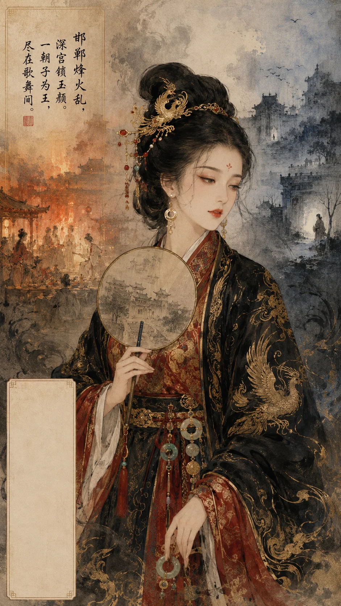

### **赵姬列传**

*赵姬——邯郸舞姬，三易其主、两失其子、一覆其国，身不由己的权力浮萍。*

**赵姬者，邯郸舞姬也，其先世不可考，或曰赵豪家女，或曰吕不韦妾。** 赵姬以色艺闻于赵都，身姿曼妙，善歌舞，时人皆谓之绝好善舞者。然姬一生未尝自决——初为不韦之赠物，继为异人之宠姬，终为嫪毐之傀儡。**观其一生，三易其主、两失其子、一覆其国——一舞姬身不由己卷入战国最顶层的权力博弈，终成秦宫血雨腥风中最悲剧的人物。**

#### **一、邯郸献姬：奇货之赠**

姬本邯郸良家女，以舞艺色相闻于赵都。吕不韦客邯郸时，闻姬名，以重金聘之，纳为妾。不韦与姬甚相得，每夜饮必使姬舞。姬素衣如雪，长袖翩跹，腰肢款摆，顾盼生姿——不韦视之如掌上明珠，珍爱非常。

然不韦志在谋国，非溺声色者。及见异人奇货可居，遂生献姬之心。一日宴异人于舍，使姬出舞。姬方登场，一旋一转，裙裾飞扬，异人目眩神夺，举杯不能下。异人起为寿，请曰："此奇女也，愿得之！"不韦佯怒，色变而起。异人惶恐谢罪。然不韦转念：千金已投异人，岂惜一女子哉？乃复召异人饮，从容谓曰："既为朋友，何惜一姬？"

是夜，不韦入姬室，与之诀。姬垂泪曰："妾已事君，且有身孕，奈何弃之？"不韦抚其肩曰："汝从异人，胜于我十倍。他日汝子为王，汝为太后，岂不美哉？"姬默然良久，终从之。遂献于异人，匿孕不言。

> 新证​​：邯郸赵王城遗址出土战国玉器、舞人俑，身姿曼妙长袖飘举，可一窥赵姬当年舞姿之风貌。

#### **二、归秦为后：子贵母危**

秦昭襄王四十八年（前259年），姬生政于邯郸。是时秦赵交兵，异人仓皇归秦，姬与政留赵，匿于豪家，几遭赵人杀戮。**五岁孤儿寡母，寄人篱下——嬴政早年的颠沛流离，与其母的赵女身份直接相关。** 异人继位为庄襄王，赵人乃送姬母子归秦。庄襄王立，姬为王后，政为太子。庄襄王在位三载而薨，政年十三即位，尊姬为太后，吕不韦为丞相，天下事皆决于不韦与太后。

#### **三、深宫新寡：旧情与毒计**

庄襄王在位三载而薨，姬年未及三十，新寡深宫。长夜寂寂，帷帐空悬，姬每对镜自伤，叹年华之易逝。不韦以仲父之尊，常入宫议事，与姬旧情未了，遂私通如故。二人幽会于太后寝殿，常至深夜，宦者侍女皆屏退，宫中无人不知而无人敢言。

然嬴政年岁渐长，聪察有威，不韦恐事泄及祸，日夜忧惧。欲绝太后之念，又恐太后怨而泄前事。乃阴求市井奇人，得嫪毐。

**嫪毐入宫**：不韦使人诬毐罪，收狱中，赂狱吏拔其须眉，伪为腐刑。遂以宦者名义献于太后。太后初不以为意，及召毐侍寝，一试之下，大悦，竟不能舍。遂徙毐于雍城大郑宫，厚赐金帛，日夜宠幸。太后与毐居，数月即怀身孕。太后恐人知，诈称卜筮当避时，遂移居雍城。毐由此得专房之宠，出入宫闱，僭用王舆，无人敢问。

毐因宠益骄，诈称宦官，出入宫闱无禁，权倾朝野，封长信侯，食邑山阳、太原，门客数千，结党营私，甚至言于太后曰：政乃不韦子，非先王骨肉！太后信之。

> 太史公案：不韦献嫪毐，实为自保之计。**然一毒引一毒更甚——嫪毐之势竟凌驾不韦之上。** 不韦以商人精明算计天下，却未能算透：太后之情欲，较天下更不可控。

#### **四、嫪毐之乱：宫闱血雨**

始皇九年（前238年），政冠礼于雍，毐惧事泄，盗太后玺及政玺，勒兵反。攻蕲年宫，政急遣昌平君、昌文君发卒平叛。毐败走，追获车裂，夷三族。

| **人物** | **在赵姬生命中角色** | **下场** |
|---|---|---|
| 吕不韦 | 旧情人，献姬又献毐 | 罢相，饮鸩而死 |
| 嫪毐 | 新宠幸，叛军方寸 | 车裂，夷三族 |
| 二幼子 | 太后与毐所生 | 囊扑诛杀（装入布袋扑杀） |
| 赵姬本人 | 权力博弈的棋子 | 被囚雍城 |

> 新证​​：咸阳塔尔坡战国秦墓出土多具被肢解人骨，骨骼有刀斧痕，或与嫪毐之乱被诛者有关。

#### **五、母子离心：茅焦犯颜**

政怒，欲诛太后。齐客茅焦谏曰：陛下欲威服天下，而弑母乎？天下闻之，必以陛下为不孝！车裂假父、扑杀二弟、囚禁生母——政已背负不仁之名；若再加弑母，则天下士人谁愿归秦？政悟，乃迎太后归甘泉宫，然终不复亲近。

茅焦之谏非为赵姬，而为嬴政之政治名声。**然母子之情至此已绝——赵姬晚年虽复位号，实为冷宫囚徒。** 后政追尊母为帝太后，与庄襄王合葬芷阳（今西安临潼）。

> 新证​​：芷阳秦东陵（1980年代探明）有"亞"字形大墓，或为庄襄王与帝太后合葬处。陪葬坑中出土陶俑、铜车马残件，规制极高。

> **太史公曰**：
>  赵姬以一舞姬，骤贵为太后，位极人臣，然耽于情欲，纵容嫪毐，几覆秦祚。其兴也，吕不韦之力；其祸也，亦不韦之谋。然余独悲姬之身不由己：**初为商人赠物，再为质子玩物，终为权臣毒饵——一生三易其主，未尝一日自主。**
>  世人多责赵姬淫乱误国，然观嫪毐之乱：一宦者（伪）竟能盗太后玺、发县卒、攻蕲年宫——岂一妇人纵容所能致？此乃吕不韦培植私党、嫪毐趁势坐大、秦廷制度失控之集中爆发。**赵姬不过权力洪流中一叶浮萍，载之者不韦，覆之者亦不韦。**
>  太史公载其事迹于《吕不韦列传》而不单独立传，非轻视也，乃以姬为不韦权谋之延伸、秦政失序之症候。**读赵姬传，不读宫闱艳史，而读权力失控之鉴也。**

------

#### **考异与补遗**

1. **出身之谜**
    赵姬之出身，《史记》自相矛盾：一说为“邯郸诸姬”，一说为“赵豪家女”。考其时，吕不韦以商贾之身攀附权贵，纳豪家女为妾可能性较低，故舞姬之说更近史实。然邯郸豪族多与赵王室联姻，若赵姬果为豪家女，则其母子留赵时或得家族庇护，方免于难。
2. **嫪毐之宠与权势**
    嫪毐得宠后，权势一度凌驾吕不韦。《战国策》载：嫪毐封长信侯，以河西、太原为封田，门客游士争趋之。其党羽甚至私铸钱币，聚敛财富，与吕不韦分庭抗礼。始皇九年（前238年），嫪毐叛乱时，曾率门客及卫卒数千人，可见其势力已渗透军政。近年发现咸阳塔尔坡秦墓出土有官印封泥长信厩丞，证明嫪毐之封地确置官署，俨然小朝廷。
3. **茅焦谏言之深意**
    茅焦以孝道劝谏嬴政，实则洞察嬴政欲统一天下需正名。嬴政虽杀二十七谏臣，终纳茅焦之言，迎太后归宫，盖因孝道为儒家治国之本，嬴政欲以仁德收揽民心，为日后称帝铺路。
4. **赵姬之结局**
    赵姬被囚雍城期间，吕不韦饮鸩自尽（前235年），其临终前上书嬴政，言“臣闻秦王老而爱异人，此臣之所以大恐也”，或暗示其与嬴政生母关系之隐秘。赵姬晚年虽复位，然终不得见嬴政，郁郁而终（前228年）。

------

#### **宫闱秘事考**

- **嬴政身世疑案**
   吕不韦献姬前赵姬已孕之说，见于《史记·吕不韦列传》：吕不韦取邯郸诸姬绝好善舞者与居，知有身。然《战国策》无此记载。清代梁玉绳考辨曰：不韦献姬时，政尚未生，此乃野史附会耳。近年秦始皇陵出土器物铭文无一字提及吕不韦与嬴政之血缘关系，然亦不能排除秦廷有意隐讳。**此案两千年无定论，或将成为中国历史上最著名的身世悬案。**
- **赵姬年表**
  | **时间** | **事件** |
  |---|---|
  | 前261年（约） | 入吕不韦府为妾 |
  | 前259年 | 生嬴政于邯郸 |
  | 前257年 | 异人逃归秦，赵姬与政匿于赵 |
  | 前251年 | 归秦，立为王后 |
  | 前247年 | 庄襄王卒，政立，尊为太后 |
  | 前240年（约） | 收嫪毐为宠 |
  | 前238年 | 嫪毐之乱，赵姬被囚雍城 |
  | 前237年 | 茅焦谏，迎归甘泉宫 |
  | 前228年（约） | 赵姬卒，葬芷阳 |

------

**赞曰**：
 邯郸起舞，一朝倾国；
 深宫锁怨，嫪毐祸烈。
 吕相权谋，茅焦忠烈；
 太后悲歌，千古谁说？