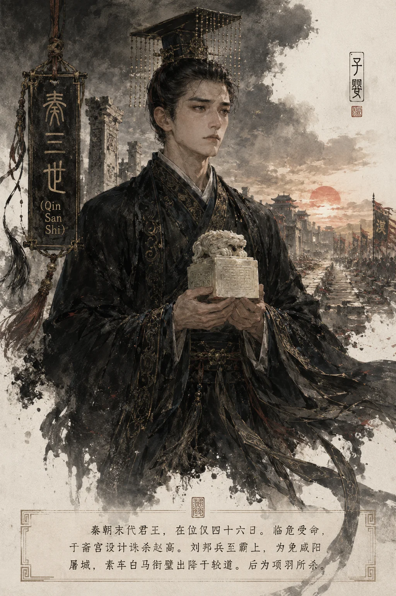

## 秦三世秦王本纪​​

*秦三世像——子婴临危受命，四十六日而秦亡*

**三世王婴者，嬴姓，身世扑朔——或曰始皇孙扶苏子，或曰庄襄王幼子（始皇弟），或曰成蟜遗孤（始皇侄）。** 二世屠戮宗室，公子十二僇死咸阳、十公主矺死杜邮，婴独得免。及赵高弑二世于望夷宫，欲自立而百官不从，乃立婴为秦王，去帝号。婴临危受命四十有六日：诛权奸于斋宫，献玺绶于轵道，身没而暴秦终焉。其存亡之际智勇毕现，然大厦将倾独木难支。

---

#### 一、身世疑云：乱世孤臣的血脉迷局

##### 宗室劫余

二世诛戮宗室时，婴以其谏二世勿杀蒙氏而得见于史："诛忠臣而立无节行之人，内使群臣不信，外斗士离意！"（《史记·蒙恬列传》）二世虽不纳，然婴之胆识已彰。何以独得免？或因其母族卑微不为赵高所忌，或因其年幼未居显位。

##### 四说考辨

| 学说 | 出处 | 依据 | 矛盾 |
|------|------|------|------|
| 二世兄子说（扶苏子） | 《秦始皇本纪》 | 二世兄子 | 扶苏死年三十余，遗子难及弱冠预谋诛高 |
| 二世兄说 | 《六国年表》 | 二世兄，秦三世 | 胡亥既屠尽诸兄，焉得遗此长君？ |
| 始皇弟说 | 《李斯列传》 | "始皇弟婴" | 始皇弟唯成蟜（叛赵）、嫪毐子（早诛） |
| 始皇弟子/成蟜遗孤说 | 马非百考 | 成蟜降赵遗子在秦，名"婴"，年岁合诛高 | 史料间接，无直接证据 |

按：马非百"成蟜遗孤"说近真——成蟜叛赵时遗幼子于秦，与胡亥同辈不遭忌，年齿可预诛高密谋。然无直接出土文献佐证，仍属推测。

---

#### 二世三载：四十六日速览

| 纪日 | 大事 |
|------|------|
| 二世三年八月 | 赵高弑胡亥于望夷宫（参见 [秦二世皇帝本纪](../本纪/秦二世皇帝本纪.md)） |
| 八月下旬 | 赵高欲自立，百官不从；召婴授玺，约灭秦宗室而王关中 |
| 九月 | 婴称疾斋宫，诱赵高入见，韩谈刺高，夷三族（参见 [赵高列传](../列传/赵高列传.md)） |
| 九月至十月 | 婴拜将守峣关，刘邦用张良计绕黄山击蓝田，秦兵大溃 |
| 汉元年冬十月 | 刘邦至霸上，婴素车白马系组衔璧降于轵道 |
| 十二月 | 项羽入咸阳，杀婴并诸公子，焚宫室，秦社稷绝 |

---

#### 二、斋宫除奸：智诛赵高的雷霆手段

##### 假病设局

赵高弑二世后，召婴曰："秦地益小，空名帝，不可。宜为王如故。"（《史记·秦始皇本纪》）授玺斋庙，实欲伺机杀之。婴洞悉其诈，谓二子及韩谈曰："高杀二世，惧诛故立婴。今约楚灭秦宗室而王关中，诱我谒庙，庙中即杀我！"遂称疾不往。

##### 一剑定乾坤

高果亲至斋宫催逼，方入殿，韩谈挺剑贯其胸。昔指鹿为马之奸雄，终毙于孺子之手！婴下令夷赵高三族于咸阳市——沙丘阴谋始作俑者，至此尽灭（参见 [赵高党羽列传](../列传/赵高党羽列传.md)）。

##### 回光返照

婴虽收皇帝玺，然天下已非秦有：

- **关中空虚**：章邯二十万军降楚（参见 [章邯王离列传](../列传/章邯王离列传.md)），王离边军覆巨鹿；
- **岭南隔绝**：赵佗绝新道自立，五十万南征军不复北援（参见 [南越尉佗世家](../世家/南越尉佗世家.md)）；
- **民心思变**：刘邦"约法三章"传檄至，父老箪食以待；
- **六国蜂起**：项羽破釜沉舟，燕赵旌旗蔽函谷。

婴拜将守峣关，然张良一计"绕黄山、击蓝田"，秦兵溃散如沙。

---

#### 三、轵道衔璧：素车白马的帝国终章

##### 降与战的抉择

汉元年冬十月，刘邦屯兵灞上。关中尚有三策可谋——武关有秦守军可拒险，蓝田可效楚汉相持，退守巴蜀可待岭南五十万秦军北援。然婴审时度势：

- **军心已散**：章邯二十万降楚，秦人视从军为死路；
- **民心尽失**：秦法苛暴，父老唯恐秦不亡；
- **外援断绝**：岭南军远隔五岭，北边军早已溃散。

**素车白马，非怯懦，乃以一人之辱换咸阳万户之生。**

##### 轵道献玺

婴解玉玺、系组绶，乘白马拉素车，着丧服载空棺，伏轵道亭献降。《秦纪》载其姿："色无忿容，如赴旧约"，盖知暴秦当亡，甘为殉葬人。樊哙请诛婴，邦曰："怀王遣我，固以宽大。且人已降，杀之不祥。"（《史记·高祖本纪》）

> 新证​​：咸阳宫遗址出土汉代初年瓦当"汉并天下"，证刘邦灭秦后迅速启用秦宫室与行政体系。秦文明之物质层面并未断绝，改变者一姓耳——**婴以身为祭，换得咸阳未遭屠城之劫，秦制得以汉名延续。**

##### 项羽入关，嬴氏绝祀

项羽入咸阳，杀婴并诸公子，焚宫室，掘骊山，嬴氏血脉遂绝。或云葬骊山陪陵，然秦陵西侧"中字形大墓"究系何人，实出推测——新丰镇唐砖破冢，更证其身没名晦。唯咸阳道旁，民哀其悲，传唱曰："斋宫剑光寒，轵道素衣单。玉玺犹带血，秦川泪已干！"

---

#### 四、秦制崩溃：专制巨塔的崩解

##### 军功爵崩

婴之败亡，实乃秦制总溃。章邯降楚后，二十万关中子弟被项羽坑杀于新安——此非战之罪，乃秦军功爵制彻底破产之标志：当兵再无出路，谁复为秦战？（参见 [兵书](../书/兵书.md)）

##### 法治成暴

商君"刑弃灰于道"、韩非"术驭群臣"，至赵高尽化为构陷手段。婴虽复廷议，然"赭衣塞路，囹圄成市"之景难改——**秦法已从治国之器变为虐民之具**（参见 [律法书](../书/律法书.md)）。

##### 集权反噬

郡县驰道本利控天下，然乱起时无宗室藩屏，一夫叩关而社稷倾。秦以郡县制取代封建制，去除了中间缓冲层——当中央权威崩塌，地方既无勤王之兵，亦无藩屏之固，关中直面无险可守之绝境。

---

#### 五、身后与历史定位

##### 祭品之祭，新制之阶

婴降刘邦，非独一人屈膝，实宣告"海内为郡县，法令由一统"之秦制终结。项羽分封诸侯，复辟旧贵；刘邦承秦官制，去其苛法——**公子婴以身为祭，肇启二百年秦汉鼎革之道。**

汉承秦制而不袭秦暴：郡县相沿、律法宽简、与民休息。若无轵道之降，刘邦必攻坚咸阳，城破屠戮在所难免，秦制精华（文书行政、郡县体系）亦可能在战火中湮灭。

##### 历史三问

1. **子婴可扶否？**
   - 贾谊《过秦论》谓"婴守关中，得中佐可存秦祀"——此书生迂论。当是时，天下苦秦久矣，"伐无道，诛暴秦"之声响彻山河，纵文王复生岂能挽狂澜于既倒？
2. **降汉是对是错？**
   - 战则城屠民死、典籍焚毁；降则一人辱、万户生、秦制得传。以百代之计论，降实为智。
3. **何以身死国灭为天下笑？**
   - 非婴之罪，乃嬴氏十五载积恶之报。"**独夫之心日骄，兆民之怨成雷**"——婴不过为秦政暴虐承担了最后的历史清算。

---

#### **太史公曰**

> **婴之立也，如残烛临飓风：**
>  其智足以诛赵高——韩谈一剑，雪望夷宫之耻；
>  其仁足以恤宗庙——系组衔璧，免咸阳城之屠；
>  其哀足以警后世——素车白马，化暴秦终焉之象！
>
> 当是时：
>  北军溃于钜鹿，南卒困于五岭；
>  敖仓之粟尽为楚资，骊山刑徒皆从诸侯；
>  更兼天下苦秦久矣——
>  **纵文王复生，岂能挽狂澜于既倒乎？**
>
> 故曰：婴非庸主，而逢必亡之时；秦非天弃，而堕自掘之渊。观其轵道降阶，犹胜崇祯煤山；斋宫诛奸，不逊康熙擒鳌。然身死国灭为天下笑者，**独夫之心日骄，兆民之怨成雷**——此非婴之罪，乃嬴氏十五载积恶之报也！
>
> 后世当鉴：**法不可不立，亦不可过立；权不可不聚，亦不可独聚。秦制之美与秦制之恶，实同一源——过刚则折，过密则溃，此秦所以十五年亡，而汉所以四百年兴也。**

---

#### **附录：子婴身世四说辨**

1. **二世兄子说**（《秦始皇本纪》）
   矛盾：胡亥杀兄时，兄子应年幼难预谋诛赵高事。
2. **二世兄说**（《六国年表》）
   悖理：胡亥既屠尽诸兄，焉得遗此长君？
3. **始皇弟说**（《李斯列传》）
   存疑：始皇弟唯成蟜、二幼弟（嫪毐子），皆早亡。
4. **始皇弟子/成蟜遗孤说**（马非百考）
   近真：成蟜降赵时遗幼子名"婴"在秦，年岁合诛高事，且与胡亥同辈不遭忌。

------

**赞曰：**

> 沙丘谋篡血未干，望夷宫变烛影寒。
> 斋宫一刃诛阉竖，轵道素衣献河山！
> 玉玺犹带祖龙息，渭水已唱汉家幡。
> 莫问骊山冢何在？秦制崩处葬婴冠。

------

*本文参稽《史记》之《秦始皇本纪》《李斯列传》《高祖本纪》，兼采云梦秦简《律说》、北大汉简《赵正书》，并考今人李开元、马非百诸说，务求存真去伪。*
