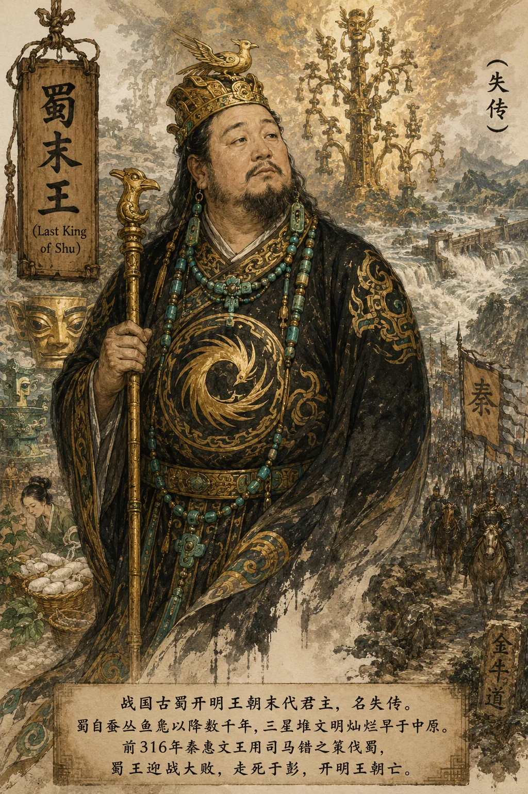

## 蜀王本纪​​

*蜀末王像——开明王朝末主，三星堆文明之续*

**蜀王者，开明王朝之末主也，名失传。** 蜀为古国，自蚕丛、柏灌、鱼凫以降，已历数千载——**当周人不过西陲小邦时，三星堆文明已灿然可观。** 杜宇禅位开明，开明氏传十二世至末主。蜀据成都平原，沃野千里，物产丰饶，然不与中国通，自为一方。

---

#### 一、古蜀文明——三星堆与金沙

古蜀之悠久，由两大考古发现可以证之：

- **三星堆遗址**（广汉，约前1600—前1000）：出土青铜神树（高约4米）、纵目面具（宽1.38米）、金杖——与中原青铜文明迥异，反映古蜀独特之宇宙观。青铜神树或即《山海经》之"建木"——天地沟通之通道；
- **金沙遗址**（成都，约前1000—前600）：出土太阳神鸟金饰（中国文化遗产标志）、玉琮、青铜立人、象牙数百根——证古蜀文明在三星堆衰落后延续于此，前后蝉联千余年。

**当周人立国、诸侯分封之时，古蜀已有高度发达之青铜文明——其开化之早，不在中原之下。** 然蜀与中原隔绝，其文字、宗教自成一系，长期不为中国所知。

#### 二、秦灭巴蜀——司马错之策

**前316年，秦惠文王用司马错之策伐蜀。** 司马错与张仪在秦廷有一场著名辩论——张仪主张东伐韩，司马错主张先伐蜀。司马错之言："欲富国者务广其地，欲强兵者务富其民。"**秦惠文王从司马错，命张仪、司马错、都尉墨率军从石牛道入蜀。**

时蜀与巴相攻，俱告急于秦。蜀王率军迎战于葭萌（今四川昭化），大败。蜀王走死于彭（今四川彭州），开明王朝亡。秦遂灭蜀，置蜀郡。同年灭巴，置巴郡。**巴蜀之利——蜀之粮、巴之盐、丹砂之利——尽入于秦。**

> **太史公案**：秦灭巴蜀，一役定秦之富。"得蜀则得楚，楚亡则天下并矣。"（司马错语）**巴蜀之灭，非亡于秦之暴，实亡于地之沃。** 同一时代，三星堆之文明灿烂与中原无异，然不参与争衡，终为秦所并。蜀不知天下已变，仍自守一隅——**不进取者，终为人所取。**

#### 三、蜀灭于秦，蜀化于汉

秦灭蜀后，巴蜀并未因亡国而委顿，反而因秦之经营而获得更大发展：

- **李冰修都江堰**（约前256年）：秦昭襄王时蜀守李冰凿离堆、分岷江，使成都平原成"天府之国"——**此水利工程使用两千二百余年至今，为世界历史最长之无坝引水工程**（参见 [河渠书](../书/河渠书.md)）；
- **秦移民实蜀**：秦灭蜀后屡次徙民入蜀，中原文化与蜀文化由此交融；
- **蜀为秦之粮仓**：巴蜀之粮经栈道输关中，为秦统一提供后勤支持——**秦之统一，巴蜀供其粮；汉之兴，巴蜀给其养。**

> **太史公曰**：
> **蜀与秦，同出西陲。秦兼六国，蜀为秦所并——一以武力进取，一以闭关自守，成败可知。**
> 然秦虽并蜀，蜀亦化秦。都江堰成，成都平原始为天府——**秦取巴蜀而利天下，巴蜀入秦而文明开。** 同一蜀地，先有三星堆之灿烂，后有都江堰之永利。**蜀之国灭，而蜀之文明融入中国；蜀之名失，而蜀之精神永驻天府。**
