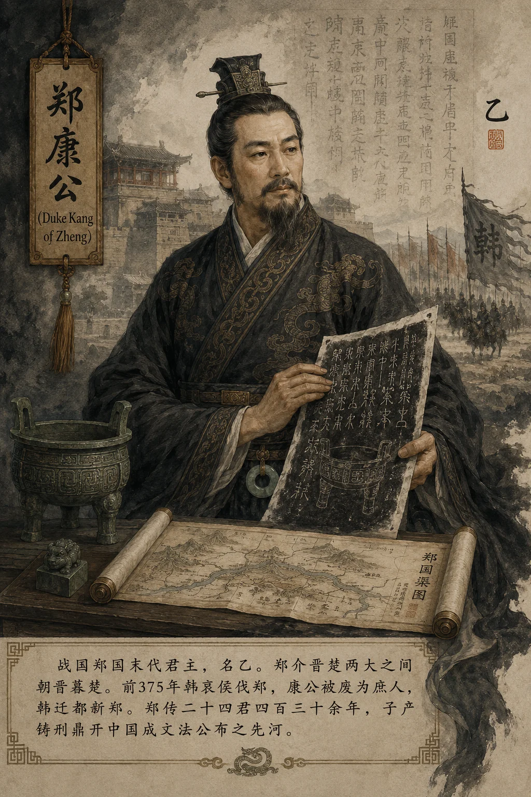

## 郑康公本纪​​

*郑康公像——郑末主，韩灭郑而康公亡*

**郑君乙者，郑末主也，谥康公。** 郑为周室近亲，桓公友为周厉王少子。犬戎之乱时，桓公死之；武公佐平王东迁，灭虢郐而迁新郑；庄公时射王中肩，小霸一时。然郑介晋楚两大之间，朝晋暮楚，为春秋小国之典型。入战国，晋分为三，郑介韩魏之间，形势更加危殆。

---

#### 一、郑韩之争始末

郑之于韩，乃心腹之患。**韩欲取郑以通南北之道——得郑则韩国本土与宜阳（韩之西大门）连为一体，为韩争胜于秦魏之根本。** 故韩列侯以来，历代韩君无日不思灭郑。

然郑据新郑城坚，又有魏国为援——郑事魏以抗韩，韩屡攻郑，魏辄救之。郑在韩魏夹缝中竟又存近百年的原因在此。然终弹丸之地，久存不易。**郑之存也，恃魏；郑之亡也，亦因魏衰。**

#### 二、韩灭郑与迁都

**前375年，韩哀侯趁魏与赵争战、无暇南顾之机，大举伐郑。魏不能救，郑遂亡。郑康公被废为庶人，韩迁都于新郑。** 郑自郑桓公始封（前806年），历二十四君四百三十余年而亡。

> **太史公案**：郑之兴也，以庄公射王中肩——天子之威，一矢落之；郑之衰也，以介晋楚之间朝晋暮楚——大国争霸，小国如风中烛。**郑之亡也，以韩欲夺其地而迁都——灭郑而都郑，韩之深谋也。** 然韩都新郑后不过百四十年，即为秦所灭——同一新郑，郑灭于韩，韩灭于秦，岂非轮回报应？

#### 三、郑国渠——亡郑之韩反资强秦

韩灭郑后，韩桓惠王欲"疲秦"以保韩，遣水工郑国入秦，劝秦凿泾水之渠。韩之谋：使秦全力修渠，无暇东伐。

然事与愿违——郑国渠成，溉关中四万顷，秦因之益富足强盛。韩之智谋，反使秦如虎添翼。**同一郑国（水工之名），以韩人身份为韩疲秦，反使秦因郑国渠而强，终灭韩——同一"郑"字，既为灭于韩之郑国，又为强秦灭韩的郑国渠。岂非天数循环？**（参见 [郑国列传](../列传/郑国列传.md)）

> 新证​​：河南新郑郑韩故城遗址发现春秋至战国连续叠压的文化层——下层为郑国宫殿基址，上层为韩国宫室遗存。城墙上有修补痕迹，证韩灭郑后直接沿用郑之城垣，仅作扩建。**灭其国而用其城——韩虽灭郑，亦不得不承认郑人建城之工。**

---

#### 四、郑之遗产——庄公、子产与法家先声

郑虽国小，其于中国制度文明之贡献，不在大国之下：

- **郑庄公小霸**（前743—前701）：克段于鄢、射王中肩，开春秋诸侯挑战周天子之先河——**王权之坠，始于一箭**；
- **子产铸刑书**（前536年）：将法律铸造于鼎，公之于众——中国历史上第一次成文法公布，打破"刑不可知则威不可测"之旧制，为法家之先声；
- **子产不毁乡校**：保留国人议政场所，开舆论监督之端。

> **太史公曰**：
> **郑四战之地无险可守，能不亡乎？然庄公之霸业、子产之刑鼎——皆开中国制度之先河。**
> 子产铸刑书，使法可知；商鞅改法为律，使法可行；秦统一法律，使法同天下一——**一部中国法制史，起点不在秦，而在郑之子产。** 郑虽国小，其于制度文明之贡献，岂在三晋之下？
