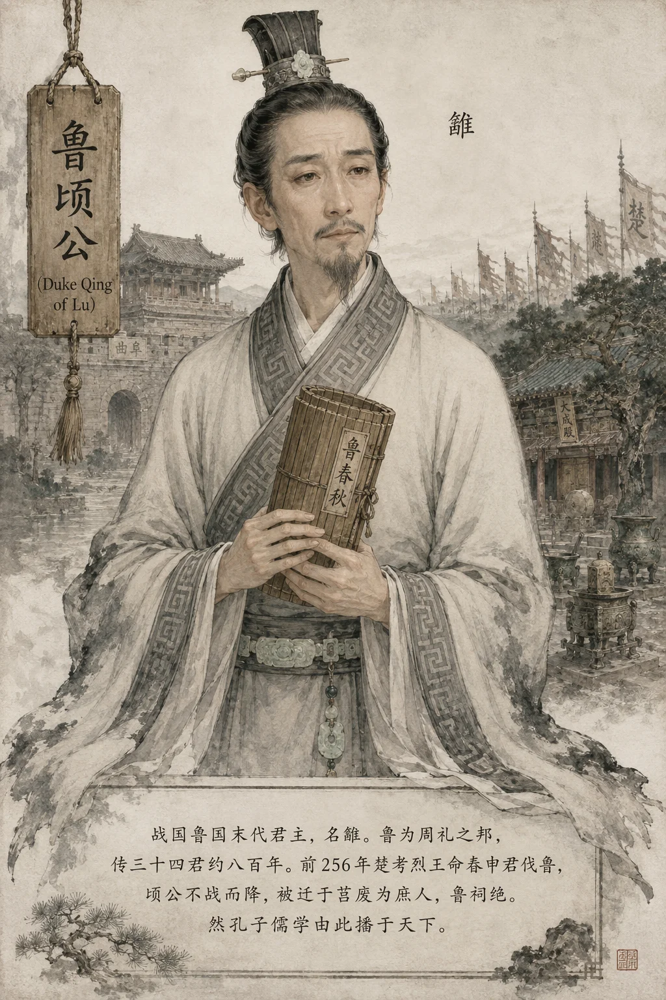

## 鲁顷公本纪​​

*鲁顷公像——周礼尽在鲁，顷公为终*

**顷公雠者，鲁末主也。** 鲁为周礼之邦，周公旦之子伯禽所封。周室衰而鲁独守周礼——"周礼尽在鲁矣"。至战国之世，鲁以弱国守礼，不修兵革。悼公、元公、穆公、共公、康公、景公、平公、湣公——八世碌碌，唯事楚、事齐、事魏，苟延残喘。

---

#### 一、鲁何以久存八百年

鲁在战国群雄中实力最弱，然能存至战国末年，其因有三：

1. **守礼之名**：鲁为周公之后，周礼所出之地。列国虽欲灭鲁，犹惮于"灭礼乐之邦"之名。齐桓公霸业时尚须"存鲁"以表仁义；
2. **侍强自保**：鲁善于在大国间求生存——朝齐暮楚、事晋附魏，外交灵活，不惜卑辞厚币；
3. **不树强敌**：鲁不曾称霸、不曾扩张，无必亡之由。

然至战国末，礼崩乐坏已成定局——**当列国以甲兵相争、以斩首为功时，鲁守礼乐不修战备，如执玉帛以御虎狼。**

#### 二、楚灭鲁

**顷公立二十四年（前256年），楚考烈王命春申君黄歇伐鲁（参见 [春申君列传](../列传/春申君列传.md)）。楚军至曲阜，鲁不战而降——非不欲战，实无力战也。顷公被迁于莒（今山东莒县），废为庶人，鲁祠绝。** 鲁传三十四君，自伯禽就封至顷公被废，约八百年（前1042—前256）。

鲁之亡，无声无息，几无血战。齐灭宋时天下震动，楚灭鲁寂然无声。**至弱之国，亡亦无人知。**

> 新证​​：曲阜鲁国故城遗址发现战国末年城墙未遭大规模破坏痕迹，城门处无战火焚烧层——证鲁之亡确未发生激战，顷公降楚之记载可信。城内出土大量战国儒家经典竹简残片，为鲁文化延续之实物证据。

---

#### 三、孔子遗产：鲁国亡而儒学兴

**然鲁虽亡，孔子之儒学不亡；曲阜虽陷，华夏文脉不绝。**

鲁于战国虽弱，却为天下文明之中心：

- **孔子**生鲁（前551年），删《诗》《书》、定《礼》《乐》、作《春秋》——**以鲁史为天下史，鲁之微而名扬千古者，以此**；
- **孔门弟子**七十子散游诸侯，子夏传经于魏、子贡游说列国——儒学由鲁而播天下；
- **孟子**（鲁国邹人）继孔子之业，在战国时鲁已衰微之时，儒学反由鲁地兴盛；
- **荀子**（赵人）游学于齐，实为鲁学之传承——"礼者，法之大分"——荀子之礼法合流思想，其源头可溯至鲁学。

> **太史公曰**：
> **鲁之国亡而道不亡，礼崩乐坏而儒术代兴。**
> 鲁以弱国存文明之根——当战国兵争之际，天下皆以铁血为务，独鲁守孔子之教。至汉武帝"独尊儒术"，鲁之国虽已灭二百余年，鲁之道（儒学）反成天下之道。**故曰：鲁之灭于楚，非亡也；鲁之兴于汉，乃真兴也。**
> 然鲁之亡，亦在战国时势之必然——**礼乐不能当刀剑，揖让不能退甲兵。** 此非鲁之过，乃时代之悲剧也。
