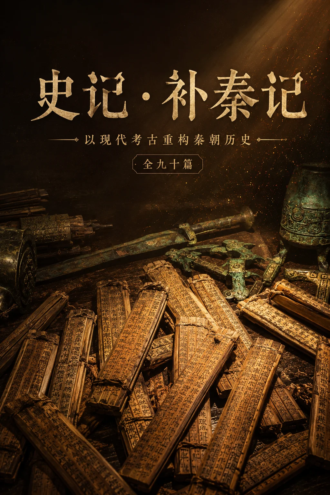

# 《史记·补秦记》目录

---

## 👑 本纪 · 17篇

帝王国君，兴亡之迹。

### 秦室三帝

- [**秦始皇本纪**](./本纪/秦始皇本纪.md) — 嬴政
  > 亲政除嫪毐、罢吕不韦；远交近攻统一战略；郑国渠间谍案；焚书争议（岳麓秦简修正伐湘山讹传）；沙丘之变；五次东巡刻石；求仙与徐福东渡

- [**秦二世皇帝本纪**](./本纪/秦二世皇帝本纪.md) — 胡亥
  > 沙丘篡位；赵高指鹿为马；诛扶苏、蒙恬、李斯；屠戮宗室十二公子十公主；骊山刑徒暴动；望夷宫被弑

- [**秦三世秦王本纪**](./本纪/秦三世秦王本纪.md) — 子婴
  > 身世四说考辨（扶苏子/成蟜遗孤）；斋宫设局诛赵高；蓝田之战秦军最后抵抗；轵道素车白马降汉；以一身换咸阳万户生

### 六国末王

- [**韩王安本纪**](./本纪/韩王安本纪.md) — 韩废王
  > 韩非变法失败；南阳守内史腾降秦；首亡之鉴；韩国贵族遗民命运

- [**赵王迁本纪**](./本纪/赵王迁本纪.md) — 赵幽缪王
  > 李牧反间冤死；代王嘉流亡联结匈奴；郭开卖国；邯郸陷落

- [**魏王假本纪**](./本纪/魏王假本纪.md) — 魏末王
  > 信陵君旧部抗秦；王贲水灌大梁；城崩王降；窃符救赵的历史回响

- [**楚王负刍本纪**](./本纪/楚王负刍本纪.md) — 楚哀王
  > 项燕拥立昌平君；郢都焚毁；李信二十万惨败；王翦六十万灭楚；"楚虽三户亡秦必楚"

- [**齐王建本纪**](./本纪/齐王建本纪.md) — 齐废王
  > 后胜受贿锁国；临淄不战而降（唯一未抵抗大国）；齐王饿死共地

- [**燕王喜本纪**](./本纪/燕王喜本纪.md) — 燕王喜
  > 太子丹质秦亡归刺秦；荆轲献图；杀子献首辽东；秦灭燕于辽东

### 诸国末代

- [**晋静公本纪**](./本纪/晋静公本纪.md) — 晋静公
  > 三家分晋最后一步：静公废为庶人，晋绝不祀
- [**鲁顷公本纪**](./本纪/鲁顷公本纪.md) — 鲁顷公
  > 礼乐之邦终灭于楚：鲁亡而儒学兴，国亡道不亡
- [**宋康王本纪**](./本纪/宋康王本纪.md) — 宋王偃
  > 桀宋暴政：射天酒色、东败齐南败楚；齐魏楚灭宋，商祀终绝
- [**郑康公本纪**](./本纪/郑康公本纪.md) — 郑君乙
  > 韩哀侯灭郑迁都新郑；庄公小霸子产刑鼎终成绝响
- [**卫君角本纪**](./本纪/卫君角本纪.md) — 卫君角
  > 诸侯最后亡者：秦二世废卫君；商鞅吴起吕不韦皆卫人
- [**中山末王本纪**](./本纪/中山末王本纪.md) — 中山王姿
  > 白狄立国称王抗赵；赵武灵王灭中山；错金银工艺震惊后世
- [**越王无彊本纪**](./本纪/越王无彊本纪.md) — 越王无彊
  > 勾践灭吴称霸至无彊伐楚败死；越国解体散为百越
- [**蜀王本纪**](./本纪/蜀王本纪.md) — 蜀末王
  > 蚕丛鱼凫开明十二世；司马错灭蜀得天府之国为秦奠基

---

## 🏛 世家 · 13篇

家族兴衰，血脉传承。

### 秦系家族

- [**王氏世家**](./世家/王氏世家.md) — 王翦→王贲→王离
  > 三代灭五国：翦灭赵燕楚、贲灭魏齐；王翦"自污求田"避君忌；巨鹿之败王离被虏，军功体系崩溃之象征

- [**蒙氏世家**](./世家/蒙氏世家.md) — 蒙骜→蒙武→蒙恬→蒙毅
  > 四代秦将：骜伐韩魏、武从翦灭楚；恬逐匈奴修长城；毅掌司法；沙丘之变恬吞药、毅被囚杀

- [**冯氏世家**](./世家/冯氏世家.md) — 冯亭→冯去疾→冯劫
  > 冯亭献上党引发长平之战；去疾谏停阿房宫；劫定皇帝制度创监察制；父子同狱引剑殉节

- [**樗里氏世家**](./世家/樗里氏世家.md) — 樗里疾→后裔
  > 宗室参政模板，"智囊"奠基；伐魏取曲沃、攻楚取召陵；后世失势于外戚崛起

- [**秦公族世家**](./世家/秦公族世家.md) — 嬴姓宗室
  > 商鞅变法后公族政策变迁：公子虔刑、扶苏仁而见杀、子婴诛高降汉；秦末宗室尽戮嬴氏绝祀

- [**公输氏世家**](./世家/公输氏世家.md) — 鲁班→秦军工官
  > 鲁班发明攻守器械；秦军工弩机误差≤0.2mm标准化；兵马俑兵器实测佐证

- [**南越尉佗世家**](./世家/南越尉佗世家.md) — 赵佗→南越五主
  > 从龙川令到南越武王；和辑百越汉越融合；外臣内帝双轨藩属；海洋丝绸之路肇始；历五世九十三年；南越王墓波斯银盒/丝缕玉衣等实证；后世考异三谜与基因融合度23%
- [**李斯世家**](./世家/李斯世家.md) — 李斯→李由
  > 谏逐客书定国策；统一制度书同文车同轨；焚书令；沙丘之谋；腰斩咸阳市夷三族

### 六国遗族

- [**楚昭屈景世家**](./世家/楚昭屈景世家.md) — 昭阳→昭涉→项燕部将
  > 三大公族分掌楚军政；秦灭楚后南迁百越延续楚文化

- [**项氏世家**](./世家/项氏世家.md) — 项燕→项梁→项羽
  > 项燕城父大捷破李信二十万、蕲南殉国遗"三户"之誓；项梁会稽起兵立楚怀王；项羽巨鹿破釜沉舟、分封天下、垓下四面楚歌、乌江不肯渡——三代四将，楚虽三户亡秦必楚

- [**齐田氏世家**](./世家/齐田氏世家.md) — 田单→田儋→田横
  > 火牛阵复齐、起兵反秦、海岛五百士殉节——最后殉节的六国贵族

- [**赵代王世家**](./世家/赵代王世家.md) — 赵嘉→赵歇
  > 代地游击抗秦联结匈奴；秦末赵歇复国；韩信背水一战灭赵

- [**魏信陵君世家**](./世家/魏信陵君世家.md) — 魏昭王→魏安釐王→魏王假→魏咎→魏豹
  > 魏昭王养子无忌封信陵；安釐王忌弟误国纵秦；信陵君窃符救赵率五国败秦毁于谗言病酒而卒；魏王假水灌大梁国灭身降；魏咎宁死不焚；魏豹韩信木罂渡军擒之——一氏五主，得士兴失士亡

- [**孔氏世家**](./世家/孔氏世家.md) — 孔子→孔鲤→孔伋→...→孔鲋→孔襄→孔臧→孔安国九世
  > 孔鲋壁藏《尚书》抗秦焚；从陈胜起义死；孔襄守宅继世；孔臧定汉仪；孔安国注《尚书》、师司马迁——三世五人，以弱抗暴，存斯文于暴秦之世

---

## 📜 列传 · 56篇

人物群像，时代风云。

### 纵横谋士

- [**鬼谷子列传**](./列传/鬼谷子列传.md) — 纵横家始祖，苏秦张仪之师；七术（捭阖反应内揵抵巇飞箝忤合揣摩）体系；秦用纵横驭外与法家治内并行为统一关键
- [**张仪列传**](./列传/张仪列传.md) — 连横破合纵总设计师；欺楚绝齐六里诈六百里；知进知退终老魏国
- [**司马错列传**](./列传/司马错列传.md) — 伐蜀伐韩之辩灭蜀定巴；得天府之国为秦统一物质根基
- [**甘茂列传**](./列传/甘茂列传.md) — 宜阳之战拔韩西门户；息壤之盟君臣互信佳话；客死魏国
- [**王绾列传**](./列传/王绾列传.md) — 统一后首任丞相；封建vs郡县之争；琅琊刻石留名
- [**魏章列传**](./列传/魏章列传.md) — 丹阳之战斩楚八万俘屈匄；秦楚实力逆转之战
- [**吕不韦列传**](./列传/吕不韦列传.md) — 邯郸奇货可居；《吕氏春秋》；献嫪毐饮鸩自尽
- [**姚贾列传**](./列传/姚贾列传.md) — 瓦解四国合纵；与李斯合谋谗杀韩非；封上卿
- [**茅焦列传**](./列传/茅焦列传.md) — 冒死谏"欲威服天下而弑母乎"；杀二十七谏臣终纳焦言
- [**范雎列传**](./列传/范雎列传.md) — 厕中残喘更名入秦；远交近攻定统一之策；废太后逐四贵集权于王；逼杀白起；荐郑安平受累；知退善终

### 变法双刃

- [**商鞅列传**](./列传/商鞅列传.md) — 商鞅变法：二十等爵、什伍连坐、废井田开阡陌、统一度量衡；河西之战；作法自毙车裂于彤
- [**韩非列传**](./列传/韩非列传.md) — 法家集大成者熔法术势三器；著《孤愤》《五蠹》；使秦被囚李斯鸩杀；著《说难》终死说难

### 春秋名臣

- [**百里奚列传**](./列传/百里奚列传.md) — 五羖羊皮七十为相；相秦七年佐穆公霸西戎；三救晋难荐蹇叔让能——开秦客卿制度之先河

### 秦之名将

- [**白起王翦列传**](./列传/白起王翦列传.md) — 白起歼灭战：伊阙24万、长平坑40万（考古修正），自刎杜邮；王翦消耗战：坚壁灭楚、请田善终——一刚烈一柔韧
- [**尉缭列传**](./列传/尉缭列传.md) — （顿弱、黄石公合传）《尉缭子》二十四篇（银雀山汉简实证）；一人三面：尉缭相秦、顿弱行间、黄石公授兵
- [**章邯王离列传**](./列传/章邯王离列传.md) — 骊山刑徒军平叛；巨鹿降项羽新安坑降卒；两大主力覆灭标志帝国终结
- [**王贲王离列传**](./列传/王贲王离列传.md) — 王贲水灌大梁灭魏；王离巨鹿被虏——三世为将一败尽没
- [**内史腾列传**](./列传/内史腾列传.md) — 灭韩擒韩王安；治南郡颁《语书》；云梦秦简实证
- [**桓齮列传**](./列传/桓齮列传.md) — 平阳斩赵十万；肥下遇李牧折戟；或为樊於期（杨宽说）

### 六国名将

- [**李牧廉颇列传**](./列传/李牧廉颇列传.md) — 李牧破匈奴败秦封武安君；廉颇长平铁壁邯郸血战；郭开受秦金谗杀逐走——一人灭赵国
- [**项燕列传**](./列传/项燕列传.md) — 城父大捷破李信二十万（秦灭六国唯一大败）；蕲南殉国"楚虽三户亡秦必楚"
- [**项梁周章列传**](./列传/项梁周章列传.md) — 会稽斩守起兵立楚怀王；周章西征叩函谷震咸阳——为刘项开路

### 赵高集团

- [**赵高列传**](./列传/赵高列传.md) — 沙丘篡诏；戮蒙氏杀扶苏屠宗室；腰斩李斯；指鹿为马；逼杀二世；被子婴诛
- [**赵高党羽列传**](./列传/赵高党羽列传.md) — 阎乐逼杀二世、赵成控制禁军——望夷宫政变执行者

### 技术·文化

- [**郑国列传**](./列传/郑国列传.md) — 韩间谍凿郑国渠疲秦；渠成溉田四万顷关中成天府；世界灌溉工程遗产
- [**胡毋敬程邈列传**](./列传/胡毋敬程邈列传.md) — 胡毋敬定小篆；程邈创隶书——隶变标志汉字进入今文字阶段
- [**甘德石申列传**](./列传/甘德石申列传.md) — 第一部恒星表；甘德观测木卫早伽利略1800年；《颛顼历》精度超罗马历
- [**淳于越列传**](./列传/淳于越列传.md) — 谏始皇封建被李斯斥；焚书议首批被议者
- [**周青臣列传**](./列传/周青臣列传.md) — 秦廷太史掌天象；献谀废封建；方士案被牵连

### 刺客·义士

- [**荆轲高渐离列传**](./列传/荆轲高渐离列传.md) — 易水送别；图穷匕见；盲筑复仇——文化复仇的终极象征
- [**太子丹列传**](./列传/太子丹列传.md) — 质秦亡归刺秦；尊荆轲易水送别；献头辽东——弱邦太子困龙之志
- [**张良列传**](./列传/张良列传.md) — 博浪沙刺秦；圯桥三约授《太公兵法》；六策定汉；功成身退从赤松子游
- [**樊於期列传**](./列传/樊於期列传.md) — 秦将叛燕；悬赏千金；荆轲借颅刺秦——千古独此一例
- [**魏无忌门客列传**](./列传/魏无忌门客列传.md) — 侯嬴献窃符计自刎；朱亥椎杀晋鄙；张耳陈馀反秦

### 反秦群雄

- [**陈涉吴广列传**](./列传/陈涉吴广列传.md) — 大泽乡起义"王侯将相宁有种乎"；张楚政权六月亡；为刘项开路
- [**项羽列传**](./列传/项羽列传.md) — 巨鹿破釜沉舟九战灭秦主力；鸿门宴纵虎；分封天下；垓下四面楚歌；乌江不肯渡——近古以来未尝有也
- [**范增列传**](./列传/范增列传.md) — 年七十投项梁立楚后；鸿门玉玦三举；谏急攻荥阳；陈平反间去增疽发背死——一夫去而楚亡之势成
- [**刘邦列传**](./列传/刘邦列传.md) — 泗水亭长斩白蛇起义；约法三章收秦民心；萧何收图籍承秦制；楚汉相争终灭项羽；即皇帝位开汉四百年
- [**陈平列传**](./列传/陈平列传.md) — 六出奇计定汉：反间范增、荥阳突围、云梦擒韩信、平城解围；与周勃诛诸吕安刘氏；善始善终以智自全
- [**萧何列传**](./列传/萧何列传.md) — 独收秦图籍使汉承秦制；守关中供兵粮为汉根本；追韩信拜大将；作《九章律》定四百年法制；功人功狗之论
- [**韩信列传**](./列传/韩信列传.md) — 胯下忍辱拜大将；暗度陈仓定三秦；背水阵破赵；潍水杀龙且平齐；垓下灭项羽——百战百胜功高震主终死妇人之手
- [**降将列传**](./列传/降将列传.md) — 从降将立场重述郑安平、司马欣、董翳在秦末困局中的抉择——制度之溃非一人之罪

### 方士·隐士

- [**方士群体列传**](./列传/方士群体列传.md) — 从方士立场重述徐巿东渡、卢生侯生直言、韩终南遁、坑儒真相及方术知识体系
- [**徐巿列传**](./列传/徐巿列传.md) — 三千童男女东渡；或至日本成文化播种者；东亚共祭
- [**商山四皓列传**](./列传/商山四皓列传.md) — 避秦焚书隐商山；晚年出山辅刘盈
- [**伏生列传**](./列传/伏生列传.md) — 壁藏《尚书》；汉初九十口授二十九篇——今文《尚书》之源

### 女性列传

- [**宣太后列传**](./列传/宣太后列传.md) — 中国第一位太后摄政41年；用白起灭义渠；范雎"闻秦有太后不闻有王"罢四贵
- [**赵姬列传**](./列传/赵姬列传.md) — 邯郸舞姬生嬴政；与不韦旧情复燃；收嫪毐酿祸乱——身不由己的权力浮萍
- [**巴清列传**](./列传/巴清列传.md) — 丹砂女王富埒王侯；助修长城；始皇筑"女怀清台"；首位女企业家
- [**华阳夫人列传**](./列传/华阳夫人列传.md) — 楚系外戚；立异人为嫡；刻玉符定秦嗣
- [**胡亥母妃列传**](./列传/胡亥母妃列传.md) — 胡亥生母之谜；始皇后宫终生不立后；缺席的母亲造就失序的帝国
- [**君王后列传**](./列传/君王后列传.md) — 齐国末代实权女君；玉连环事件；不战而降争议
- [**如姬列传**](./列传/如姬列传.md) — 魏王宠姬夜盗虎符救赵；魏亡自缢殉国
- [**嫪毐列传**](./列传/嫪毐列传.md) — 假宦者宠太后封长信侯；盗玺反蕲年宫；车裂夷三族
- [**成蟜列传**](./列传/成蟜列传.md) — 14岁使韩不战取南阳；屯留兵变谜案；子婴为其遗孤说

### 南疆百越

- [**尉屠睢列传**](./列传/尉屠睢列传.md) — 统五十万南征军；开凿灵渠；西瓯战役殉国
- [**任嚣列传**](./列传/任嚣列传.md) — 南海郡守和辑百越奠基；临终授权赵佗割据

### 医者·其他

- [**淳于意夏无且列传**](./列传/淳于意夏无且列传.md) — 私藏《黄帝内经》；药囊救秦皇于荆轲匕下
- [**春申君列传**](./列传/春申君列传.md) — 治吴兴利开江南文脉筑苏州城疏黄浦江（上海简称"申"）；李园移宫棘门被杀
- [**后胜列传**](./列传/后胜列传.md) — 齐相受秦金锁国——齐国灭亡第一责任人
- [**郭开列传**](./列传/郭开列传.md) — 受秦金谗杀李牧逐廉颇；王翦闻牧死夜宴"敬郭开将军"

---

## 📊 表 · 10篇

年表谱系，制度沿革。

### 时序·世系

- [**六国灭国年表**](./表/六国灭国年表.md) — 前230-前221年十年灭国战役时序，含秦军统帅、战术、俘王处置全记录
- [**秦世系年表**](./表/秦世系年表.md) — 非子至子婴38世690年完整世系，含都邑变迁与陵寝制度
- [**韩国世系年表**](./表/韩国世系年表.md) — 韩虔分晋至韩王安被虏：申不害变法、韩非入秦、内史腾灭韩
- [**赵国世系年表**](./表/赵国世系年表.md) — 赵籍分晋至代王嘉被虏：胡服骑射、长平之战、李牧郭开
- [**魏国世系年表**](./表/魏国世系年表.md) — 魏斯分晋至魏王假降秦：李悝变法、桂陵马陵、信陵君窃符救赵、王贲水灌大梁
- [**楚国世系年表**](./表/楚国世系年表.md) — 熊通称王至负刍被俘：楚庄王问鼎、白起拔郢、项燕抗秦城父大捷
- [**燕国世系年表**](./表/燕国世系年表.md) — 召公奭封燕至王喜被俘：昭王黄金台、乐毅伐齐、荆轲刺秦
- [**齐国世系年表**](./表/齐国世系年表.md) — 姜太公至王建饿死：桓公称霸、威宣稷下学宫、田单复齐、后胜受金锁国
- [**晋国世系年表**](./表/晋国世系年表.md) — 叔虞封唐至静公废为庶人：文公称霸、六卿专权、三家分晋
- [**鲁国世系年表**](./表/鲁国世系年表.md) — 伯禽就封至顷公灭于楚：春秋兴衰、孔子儒学、礼乐之邦终亡
- [**宋国世系年表**](./表/宋国世系年表.md) — 微子启封至王偃灭于齐：宋襄之仁、泓之战、商祀终绝
- [**郑国世系年表**](./表/郑国世系年表.md) — 郑桓公封至郑君乙灭于韩：庄公小霸、子产铸刑书、郑国渠谋秦
- [**卫国世系年表**](./表/卫国世系年表.md) — 康叔封商墟至君角废于秦二世：卫多君子、商鞅吕不韦吴起皆卫人
- [**中山国世系年表**](./表/中山国世系年表.md) — 白狄鲜虞至灭于赵：中山称王抗赵、错金银工艺、兆域图铜版
- [**越国世系年表**](./表/越国世系年表.md) — 无余封会稽至无彊灭于楚：勾践卧薪尝胆灭吴称霸
- [**巴蜀世系年表**](./表/巴蜀世系年表.md) — 蚕丛鱼凫至秦灭巴蜀：三星堆金沙文明、司马错取蜀为秦奠基
- [**秦始皇东巡刻石表**](./表/秦始皇东巡刻石表.md) — 五巡路线七刻石存佚考，含随行大臣与政治意图

### 官制·军制

- [**秦相世系表**](./表/秦相世系表.md) — 商鞅至李斯的秦相更迭，反映相权与君权消长
- [**秦大将军世系表**](./表/秦大将军世系表.md) — 白起至蒙恬的军权更迭，反映军功爵制盛衰
- [**秦国尉世系表**](./表/秦国尉世系表.md) — 白起→王龁→尉缭→王翦→蒙恬→章邯，国尉官制与虎符军权

### 地理·制度

- [**郡县沿革表**](./表/郡县沿革表.md) — 36郡至48郡的行政扩张，含郡名、治所、置郡时间
- [**六国公族迁徙表**](./表/六国公族迁徙表.md) — 六国贵族迁咸阳陇西的强制安置
- [**秦统一度量衡表**](./表/秦统一度量衡表.md) — 长度/容量/重量/货币四方统一，含商鞅方升与两诏权实物考
- [**秦陵寝封君表**](./表/秦陵寝封君表.md) — 西垂/雍城/咸阳三大陵区44座陵墓

---

## 📖 书 · 10篇

专题研究，制度之维。

- [**书同文考**](./书/书同文考.md) — 小篆推行与隶书底层实践：官方用小篆立标准、基层用隶书行政文书
- [**治国书**](./书/治国书.md) — 韩非法术势、尉缭子仁政、王绾李斯封建郡县之争——秦治国思想的多元光谱
- [**黄老书**](./书/黄老书.md) — 道生法·无为而治·刑德并济：尉缭以道论兵、张良黄老谋略功成身退、陈平奇计归清静、盖公曹参萧规曹随——秦不用黄老而亡，汉用黄老而兴
- [**黄石书**](./书/黄石书.md) — 黄石一脉传承谱系：黄帝→太公望《六韬》→尉缭(黄石公)→张良→韩信——道兵合一·先文后武·因势利导·功成身退；得黄石之道之全者生，得其半者亡
- [**鬼谷书**](./书/鬼谷书.md) — 捭阖纵横术系统——鬼谷七术详解、纵横家谱系（苏秦张仪范雎姚贾蒯通）、七术在秦灭六国中的连环运用、纵横与法家兵家儒家之异同
- [**律法书**](./书/律法书.md) — 从商鞅改法为律到云梦秦简《秦律十八种》，秦律非简单"严刑峻法"
- [**货殖书**](./书/货殖书.md) — 半两钱统一、官营手工业标准化、灵渠漕运——秦经济统一制度基础
- [**河渠书**](./书/河渠书.md) — 郑国渠、都江堰、灵渠三大水利工程——以暴政始而以永利终
- [**兵书**](./书/兵书.md) — 尉缭子兵法、秦弩标准化（误差≤0.2mm）、铬化青铜剑、军功爵制与军事崩溃
- [**农书**](./书/农书.md) — 垦草令与商鞅农业革命；秦田制阡陌体系；铁器牛耕推广；仓储制度与敖仓

---

> **总计 121 篇** · 本纪17 · 世家14 · 列传56 · 表24 · 书10
>
> *《史记·补秦记》以传统史书体例结合现代考古发现，系统重建秦朝历史全貌*